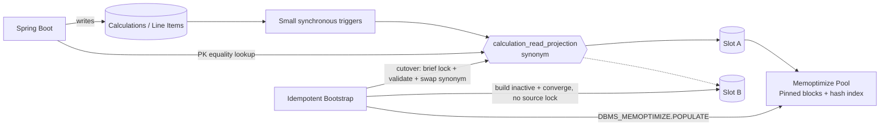

# Oracle Memoptimized Read Projection PoC

PoC em Java 21 + Spring Boot 4 + Oracle AI Database Free que implementa o padrão
**Trigger-Maintained Synchronous Read Projection with Idempotent Bootstrap** e
usa **Memoptimized Rowstore Fast Lookup** no modelo de leitura, sobre um
domínio de **cálculo de tabela de preço por cliente com tarifas**.

## O ponto arquitetural importante

`MEMOPTIMIZE FOR READ` não acelera buscas arbitrárias. O Fast Lookup é usado
quando a consulta tem **um único predicado de igualdade sobre a chave primária**:

```sql
SELECT *
  FROM calculation_read_projection
 WHERE calculation_id = :id;
```

Buscas por `customer_id`, `status`, intervalos ou predicados adicionais usam os
índices B-tree convencionais. Por isso, o endpoint principal do PoC é
`GET /api/read/calculations/{calculationId}`.

## Arquitetura



- A Source of Truth modela **preço por cliente com tarifas**:
  `customer_segments` → `price_tables` (por segmento) → `price_table_items`
  (catálogo) → `tariffs` (faixas de quantidade) → `tariff_rules` (ajustes por
  condição, ex. região/canal). Essa cadeia de 5 joins é catálogo/referência —
  poucas linhas, escrita rara.
- `calculations`/`calculation_line_items` são as tabelas de alto volume: cada
  linha resolve preço percorrendo item → tabela de preço → segmento e
  tarifa → regras. É a carga de relacionamento real que motivou trocar o
  exemplo anterior (pedidos com 27 tabelas de contexto 1:1, sem profundidade).
- `PriceResolutionService` (Java) resolve a tarifa aplicável por
  quantidade/vigência e aplica as `tariff_rules` casadas, em ordem de
  prioridade, para chegar no preço unitário final.
- Triggers delegam a atualização incremental para
  `CALCULATION_MAINTENANCE_PKG` na mesma transação da escrita.
- `calculation_read_projection` é um `SYNONYM` sobre dois slots físicos
  (`CALCULATION_READ_PROJECTION_A` / `_B`), cada um uma heap table durável
  com PK e `MEMOPTIMIZE FOR READ` habilitado desde o `CREATE TABLE` (os dois
  slots, sempre — ver `docs/architecture.md` sobre o `ORA-62149`).
- O bootstrap usa uma linha em `PROJECTION_CONTROL` como mutex entre instâncias.
- O rebuild constrói o slot **inativo** sem travar nenhuma tabela-fonte; o
  slot ativo continua servindo leitura e escrita incremental o tempo todo. A
  única pausa de escritores é o `cutover`: um `LOCK TABLE ... SHARE MODE` na
  tabela ativa, restrito a uma convergência final + validação + troca do
  synonym.
- Depois de cada cutover ou restart da aplicação, o bootstrap chama
  `DBMS_MEMOPTIMIZE.POPULATE` no slot ativo, pois o hash index em memória
  não é persistente.

## Executar

Pré-requisitos: Docker Desktop com pelo menos 4 GB disponíveis. Na primeira
execução, o Oracle demora alguns minutos. O script de setup configura
`MEMOPTIMIZE_POOL_SIZE=256M` e reinicia a instância uma vez, como exigido pelo
Oracle. Em ambientes onde o healthcheck do container relata "healthy" antes do
listener registrar o serviço `FREEPDB1` (primeiro boot com volume novo), pode
ser necessário aguardar e tentar de novo (`docker compose up -d app`) — não é
um problema desta aplicação, é o timing do próprio container Oracle.

```bash
docker compose up --build -d
docker compose logs -f oracle app
```

Credenciais locais do PoC:

- aplicação: `projection_app` / `ProjectionPwd123`
- administração Oracle: valor de `ORACLE_ADMIN_PASSWORD`, com default
  `OraclePwd123`
- serviço: `FREEPDB1` na porta `1521`

Essas credenciais são apenas para ambiente local. Em outro ambiente, crie o
schema e injete os segredos pelo mecanismo da plataforma.

## Documentação interativa da API

Swagger UI em <http://localhost:8080/swagger-ui/index.html>; o documento
OpenAPI cru em `http://localhost:8080/v3/api-docs`. Sem autenticação, como
o resto da aplicação — não expor fora de ambiente controlado.

## Verificar Fast Lookup

```bash
curl -s http://localhost:8080/api/admin/projection/status
curl -s http://localhost:8080/api/admin/projection/memoptimized
curl -s http://localhost:8080/api/admin/projection/plan/1
curl -s http://localhost:8080/api/read/calculations/1
```

O plano deve conter operações como:

```text
TABLE ACCESS BY INDEX ROWID READ OPTIM
INDEX UNIQUE SCAN READ OPTIM
```

Se `poolEnabled=false`, a instância não foi iniciada com um
`MEMOPTIMIZE_POOL_SIZE` válido. Se `tableMemoptimizeRead` não for `ENABLED`, a
tabela não está habilitada para Fast Lookup.

`status.activeSlot` mostra qual slot físico (`A` ou `B`) está atrás do
synonym no momento. Um `rebuild` bem-sucedido troca esse valor; disparar
`rebuild` de novo troca de volta.

## Escrita síncrona

```bash
curl -s -X POST http://localhost:8080/api/customers \
  -H 'Content-Type: application/json' \
  -d '{"segmentId":1,"name":"Grace Hopper","email":"grace@example.com","status":"ACTIVE"}'

curl -s -X POST http://localhost:8080/api/calculations \
  -H 'Content-Type: application/json' \
  -d '{"customerId":1,"priceTableId":1,"items":[{"priceTableItemId":1,"quantity":10},{"priceTableItemId":3,"quantity":5}]}'
```

O `COMMIT` só conclui se os triggers também atualizarem a projeção. Para validar
ou reconstruir:

```bash
curl -s -X POST http://localhost:8080/api/admin/projection/validate
curl -s -X POST http://localhost:8080/api/admin/projection/rebuild
```

## Benchmark A/B e carga de volume

Carregue dados e execute a comparação dentro do Oracle, evitando que latência
HTTP esconda a diferença. A carga é set-based (não um loop linha a linha): os
triggers incrementais são desabilitados durante o `INSERT ... SELECT` em massa
e a projeção é recuperada de uma vez com o mesmo mecanismo de Idempotent
Bootstrap (`build_inactive` + convergência + `cutover`) que a aplicação já usa.

```bash
ROWS=500000 make benchmark-load
ROWS=500000 ITERATIONS=50000 make benchmark
```

O script mede três caminhos: projeção com Fast Lookup, a mesma projeção com o
recurso temporariamente desabilitado (evict do pool, não `ALTER TABLE` — ver
`docs/architecture.md`) e a view transacional com join/agregação. Ao final,
solicita nova população do pool.

## Estrutura relevante

- `oracle/setup/01_database_setup.sql`: SGA, restart, schema e privilégios.
- `V1__create_source_and_projection.sql`: catálogo de preço/tarifa,
  `calculations`/`calculation_line_items`, os dois slots da projeção
  (synonym já embutido) e a view.
- `V2__create_projection_maintenance.sql`: `calculation_maintenance_pkg`,
  triggers incrementais e `projection_admin_pkg` (build/converge/cutover
  sem travar as fontes).
- `PriceResolutionService.java` / `CalculationCommandService.java`: resolução
  de tarifa/regras e escrita do cálculo.
- `ProjectionService.java`: bootstrap, mutex, validação e população.
- `oracle/benchmark`: carga em massa e benchmark A/B.

Detalhes e limites estão em [docs/architecture.md](docs/architecture.md).
Documentação completa (executiva, implementação, testes) a partir de
[docs/README.md](docs/README.md).
