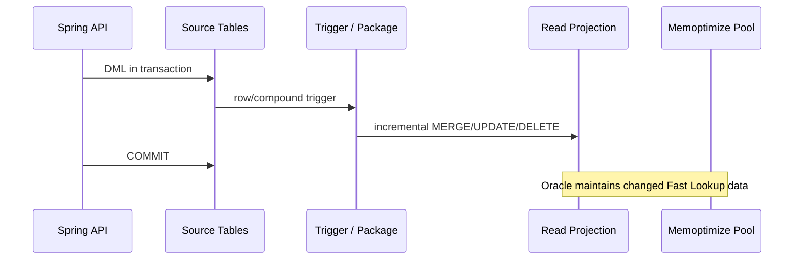

# Decisões do PoC

*Ver também: [`docs/README.md`](README.md) (índice geral), [`documento-executivo-poc.md`](documento-executivo-poc.md), [`implementacao.md`](implementacao.md), [`testes.md`](testes.md), [`fluxos-e-ciclo-de-vida.md`](fluxos-e-ciclo-de-vida.md).*

**Menu:** [Domínio](#domínio-preço-por-cliente-com-tarifas) · [Fast Lookup](#fast-lookup-não-é-o-in-memory-column-store) · [Acesso elegível](#forma-de-acesso-elegível) · [Consistência](#consistência) · [Blue/green](#bootstrap-e-rebuild-bluegreen-por-synonym) · [Carga em massa](#carga-em-massa-oraclebenchmark01_load_datasql) · [Observabilidade](#observabilidade) · [Limites](#limites-da-prova)

## Domínio: preço por cliente com tarifas

`customer_segments` → `price_tables` (por segmento) → `price_table_items`
(catálogo) → `tariffs` (faixas de quantidade e vigência) → `tariff_rules`
(ajustes por condição, ex. região/canal) é dado de referência: poucas
centenas de linhas, escrito raramente. `calculations`/`calculation_line_items`
são as tabelas de alto volume — cada linha resolve preço percorrendo uma
cadeia real de 5 joins (item → tabela de preço → segmento, tarifa → regras),
diferente do exemplo anterior (30 tabelas de pedido, 27 delas 1:1 e sem
profundidade de relacionamento).

`PriceResolutionService` aplica a tarifa cuja faixa de quantidade e janela de
vigência casam com o item pedido, calcula o preço unitário
(`PERCENT` multiplica, `FIXED` soma) e então aplica as `tariff_rules`
casadas pela condição informada, em ordem de prioridade.

## Fast Lookup não é o In-Memory Column Store

O PoC usa `MEMOPTIMIZE FOR READ`, não a cláusula `INMEMORY`. O memoptimize pool
é uma área fixa e separada na SGA: aproximadamente 75% guarda blocos pinados e
25% sustenta o hash index não persistente. `MEMOPTIMIZE_POOL_SIZE` conta dentro
de `SGA_TARGET`, tem mínimo de 100 MB e exige restart para ser alterado.

## Forma de acesso elegível

O caminho otimizado é exclusivamente point lookup pela PK completa:

```sql
SELECT * FROM calculation_read_projection WHERE calculation_id = :id;
```

Um range, um filtro em outra coluna ou até um segundo predicado não caracteriza
o Fast Lookup. Os índices por cliente/status existem para os demais casos, mas
não fazem parte do resultado atribuído ao Memoptimized Rowstore.

`GET /api/read/calculations` (busca por filtro, não por PK) reflete isso
explicitamente: `CalculationReadRepository.search` roda duas queries, não
uma — um `COUNT(*)` com os mesmos filtros (para `total`) e um `SELECT`
paginado por keyset separado (para `results`/`nextCursor`), igual a um
endpoint de busca de produção teria. Paginação é por keyset
(`WHERE (requested_at, calculation_id) < (:cursorTs, :cursorId) ORDER BY
requested_at DESC, calculation_id DESC`), não por `OFFSET`: numa tabela de
2,7M+ linhas, `OFFSET` teria que varrer e descartar cada linha pulada até
chegar na página pedida, ficando pior a cada página mais funda; keyset só
lê as linhas que de fato retorna.

**Índices por filtro não bastam sem histograma quando a coluna é
desbalanceada.** A carga em massa põe todo mundo sob um único
`customer_id` de benchmark — depois dela, `customer_id` deixou de ter uma
distribuição razoavelmente uniforme (o formato que `DBMS_STATS.GATHER_TABLE_STATS`
sem `METHOD_OPT` estima bem) e passou a ter um valor dono de ~100% das
linhas e todo o resto com poucas linhas cada. Sem histograma, o otimizador
escolhia `TABLE ACCESS FULL` até para filtrar por um cliente com 3 linhas —
mesmo plano que usaria pro cliente com 2,7M, porque assumia distribuição
uniforme e não tinha dado nenhum pra pensar diferente. `01_load_data.sql`
agora gathera stats com `method_opt => 'FOR ALL COLUMNS SIZE SKEWONLY'`
depois da carga, o que criou o histograma e trocou o plano do cliente
seletivo para `INDEX RANGE SCAN` — mesma coluna, duas respostas certas
diferentes dependendo do valor filtrado. Sem essa carga em massa
específica (distribuição mais uniforme), provavelmente nem seria
necessário.

## Consistência



Falha no trigger causa rollback da escrita. A projeção é derivada; nunca é usada
para reconstruir a Source of Truth.

## Bootstrap e rebuild: blue/green por synonym

A projeção vive em dois objetos físicos, `CALCULATION_READ_PROJECTION_A` e
`_B`. `CALCULATION_READ_PROJECTION` é um `SYNONYM` apontando para o slot
ativo — triggers, `calculation_maintenance_pkg` e o Java continuam
referenciando `calculation_read_projection` sem saber qual slot está no ar.
`DBMS_XPLAN` resolve o synonym normalmente, então `READ OPTIM` no plano
prova Fast Lookup independente da troca.

1. A instância tenta `SELECT ... FOR UPDATE WAIT 0` em `PROJECTION_CONTROL`
   e chama `reconcile_active_slot`, que corrige `active_slot` caso um
   cutover anterior tenha travado entre a troca do synonym e a atualização
   da linha de controle.
2. `UPDATE projection_control SET status = 'BUILDING' ... WHERE status <>
   'BUILDING'` funciona como segundo guard: como as etapas seguintes fazem
   DDL (commit implícito no Oracle), o lock de linha da etapa 1 não dura o
   build inteiro. Se 0 linhas forem afetadas, outra instância já está
   construindo; esta transação é revertida (liberando seu próprio lock) e a
   instância aguarda `READY`.
3. `build_inactive` faz `TRUNCATE` + `INSERT ... SELECT` no slot **inativo**
   a partir de `calculation_transactional_view`. Nenhuma tabela fonte é
   travada; o slot ativo continua servindo leitura e recebendo escrita
   incremental pelos triggers normalmente, por todo o tempo que o build
   levar.
4. `converge_inactive` roda em loop curto (`MERGE` inativo ← ativo,
   tabela-a-tabela, sem o join completo) para puxar o que os triggers já
   aplicaram no ativo enquanto o build rodava.
5. `cutover` é a única etapa que pausa escritores, e por uma janela pequena:
   popula o pool para o slot inativo antes de travar qualquer coisa (ambos os
   slots já nascem com `MEMOPTIMIZE FOR READ` — ver a nota abaixo sobre por
   que isso não pode ser ligado depois via `ALTER TABLE`); trava só a tabela
   **ativa** (`LOCK TABLE ... IN SHARE MODE`); faz uma convergência final e
   valida com `MINUS` nos dois sentidos entre inativo e ativo, abortando sem
   trocar nada se sobrar divergência; troca o synonym — a mesma instrução
   libera o lock, e é deliberadamente a última coisa antes da virada, então
   nenhum escritor bloqueado perde a escrita na borda; publica `active_slot`.
6. `ORA-62149` impede `ALTER TABLE ... MEMOPTIMIZE FOR READ` numa tabela que
   já tem coluna virtual, e qualquer índice sobre `TIMESTAMP WITH TIME ZONE`
   (como `requested_at DESC`) cria uma coluna virtual oculta automaticamente.
   Por isso os dois slots habilitam `MEMOPTIMIZE FOR READ` no próprio
   `CREATE TABLE`, antes de qualquer índice existir, e ficam assim
   permanentemente — não há liga/desliga por cutover.

Essa estratégia troca "lock de todas as tabelas fonte pela duração inteira do
build" por "pausa breve, restrita à tabela de projeção, proporcional ao delta
residual da convergência" — não é zero-downtime, mas o build em si (a parte
que pode demorar) roda sem bloquear nenhuma escrita.

## Carga em massa (`oracle/benchmark/01_load_data.sql`)

Escritas em volume (para gerar dados de teste de vários GB) não passam pelos
triggers incrementais: `ALTER TRIGGER ... DISABLE`, `INSERT ... SELECT`
set-based para `calculations`/`calculation_line_items`, `ENABLE` de volta.

A projeção **não** é resolvida com `projection_admin_pkg.cutover` nesse
caso — só com `build_inactive` seguido de uma troca de synonym manual que
valida direto contra `calculation_transactional_view`. O motivo: o
`converge_inactive` de `cutover` trata o slot **ativo** como fonte confiável
para decidir o que é órfão no slot recém-construído (correto no rebuild
incremental normal, onde os triggers do ativo continuam refletindo a
realidade enquanto o build roda). Como os triggers ficam desligados durante
a carga em massa inteira, o ativo nunca vê as linhas novas — `converge_inactive`
leria isso como "todas as linhas carregadas são órfãs" e as apagaria do slot
inativo momentos antes da troca. `build_inactive` sozinho já é a carga
completa e correta (é um `SELECT` direto da view); só falta validar contra a
fonte real e trocar o synonym, sem convergência nenhuma.

## Observabilidade

- `/actuator/health/readiness` inclui a saúde lógica da projeção.
- `/api/admin/projection/status` expõe build, contagens, divergências e
  `activeSlot`.
- `/api/admin/projection/memoptimized` verifica pool e atributo da tabela
  (resolvida dinamicamente a partir do slot ativo).
- `/api/admin/projection/plan/{id}` confirma as operações `READ OPTIM`.
- `projection.rebuild.duration` e `projection.rebuild.completed` estão no
  Micrometer; latência HTTP e pool JDBC usam as métricas nativas do Spring.

## Limites da prova

- O endpoint administrativo não possui autenticação; não deve ser exposto em
  produção.
- `PriceResolutionService` implementa uma resolução determinística e simples
  (uma faixa de tarifa por quantidade + regras por condição exata); não é um
  motor de regras genérico.
- O container usa Oracle AI Database Free; confirme edição e entitlement antes
  de transportar o desenho para outro ambiente.
- A população do pool é assíncrona. A prova definitiva é o plano de execução,
não apenas o atributo `MEMOPTIMIZE_READ=ENABLED`.
- `TRUNCATE` (em `build_inactive`) e a troca do synonym (em `cutover`) são
  DDL: cada um faz commit implícito no Oracle. A transação Spring que
  envolve o rebuild deixa de ser atomicamente reversível a partir desse
  ponto; falhas depois do cutover dependem do guard de status
  (`status <> 'BUILDING'`) e de `reconcile_active_slot` para autocorrigir,
  não de rollback.
- `validate()` não trava mais as tabelas fonte. Sob escrita concorrente
  pesada, as duas consultas `MINUS` de `mismatch_count` podem, em teoria,
  observar um instante diferente uma da outra e reportar uma divergência
  transitória; ela se autocorrige na próxima validação ou rebuild.
- O healthcheck do container Oracle pode reportar "healthy" antes do listener
  registrar `FREEPDB1` no primeiro boot com volume novo; a aplicação não tem
  retry para isso hoje.
- Oracle Database Free impõe um teto de memória combinada (SGA+PGA) por
  volta de 2 GB — confirmado ao vivo: `ALTER SYSTEM SET SGA_TARGET=3072M`
  derruba a instância com `ORA-56752`. Com uma projeção real de ~2 GB
  (tabela ativa sozinha em torno de 500 MB), isso limita o quanto
  `MEMOPTIMIZE_POOL_SIZE` pode crescer nesta edição — não é algo que se
  resolva aumentando o container. `/api/admin/projection/plan/{id}` já não
  mostrava `READ OPTIM` mesmo com poucas linhas antes da carga em massa; a
  causa raiz não foi confirmada (não é claramente só tamanho de pool, já
  que 2 linhas cabem à vontade em 256 MB) e continua em aberto — validar via
  plano de execução real antes de reportar Fast Lookup como comprovado.
