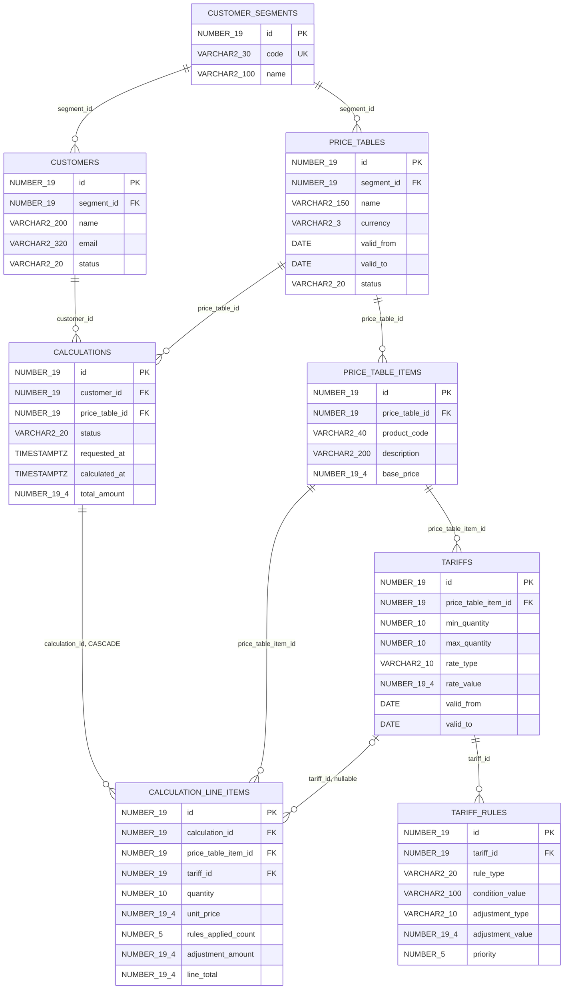
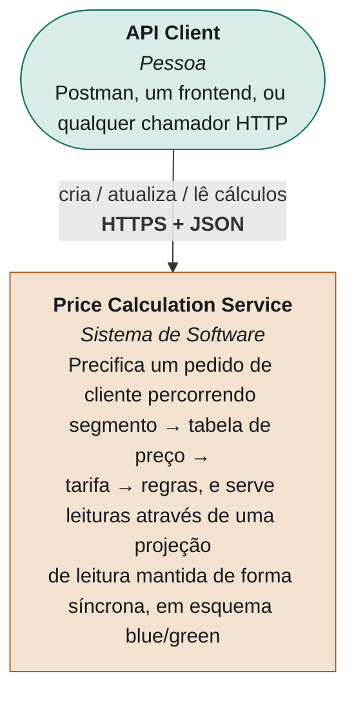
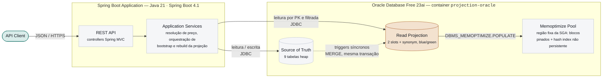
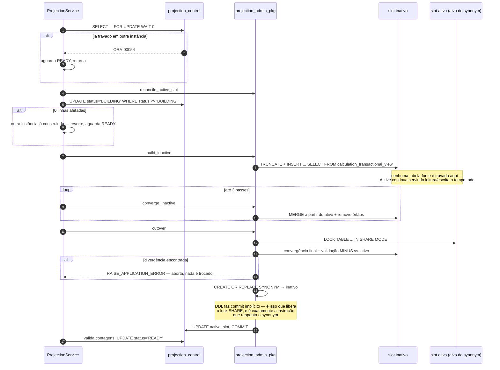
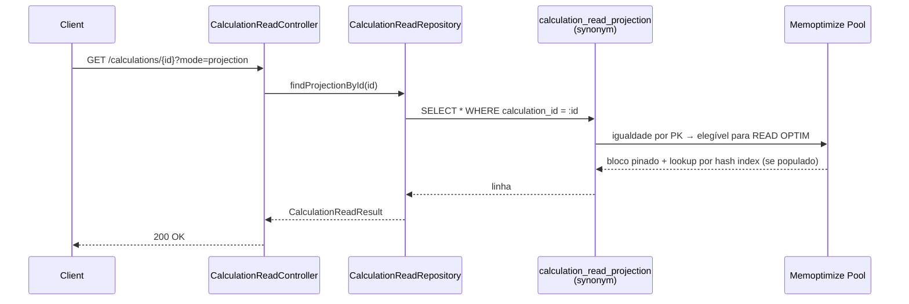
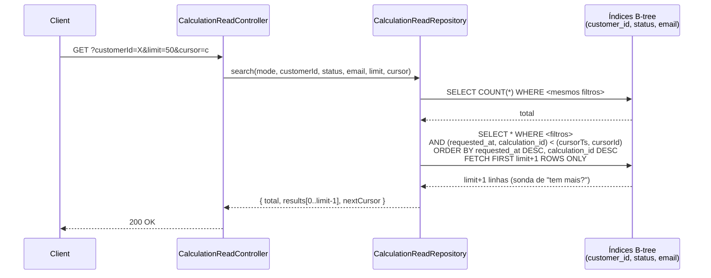
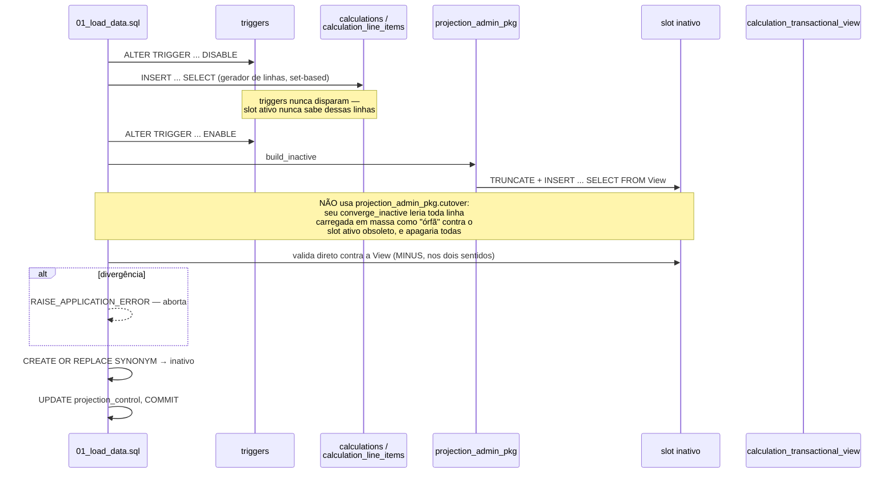
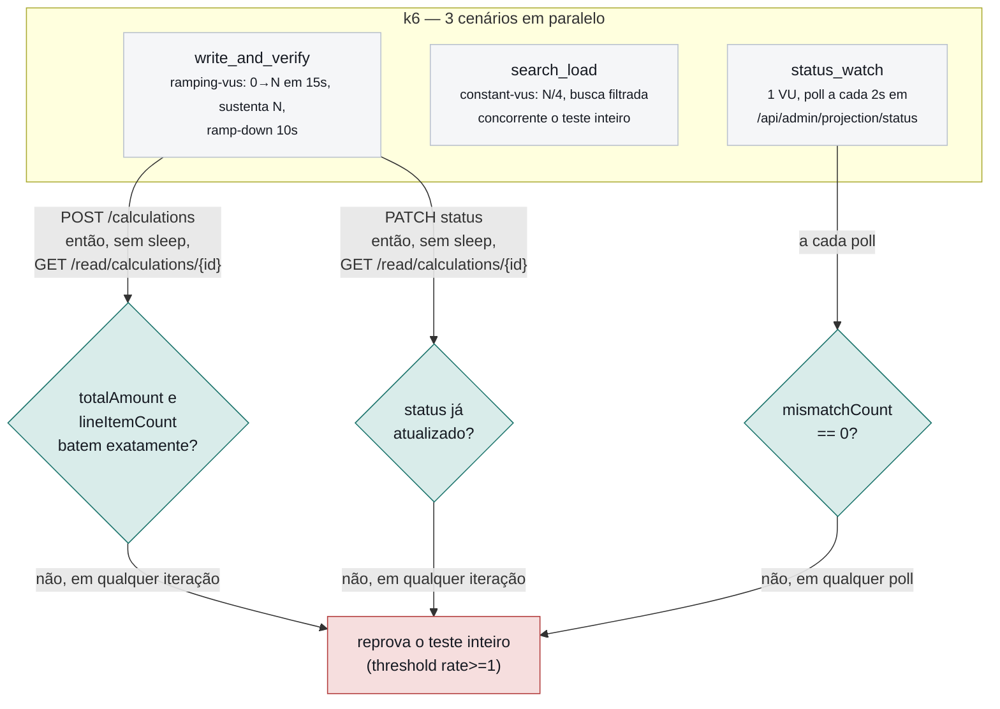
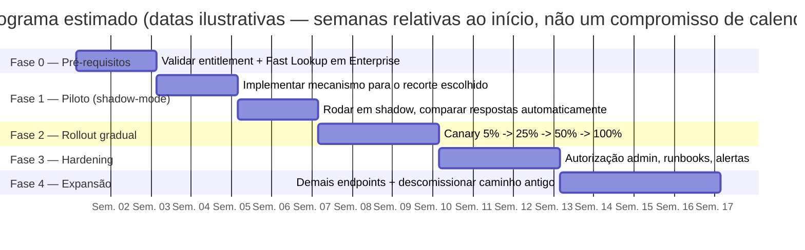

# Cache Nativo no Oracle para o Motor de Cálculo de Preço

### Documento executivo — PoC de Trigger-Maintained Synchronous Read Projection com Memoptimized Rowstore Fast Lookup

*Ver também: [`docs/README.md`](README.md) (índice geral), [`architecture.md`](architecture.md), [`implementacao.md`](implementacao.md), [`testes.md`](testes.md), [`fluxos-e-ciclo-de-vida.md`](fluxos-e-ciclo-de-vida.md).*

**Menu:** [1. Sumário Executivo](#1-sumário-executivo) · [2. A Dor](#2-a-dor-o-custo-do-cache-na-aplicação-de-price) · [3. Objetivo](#3-objetivo-da-poc) · [4. Abordagem](#4-abordagem-e-metodologia) · [5. Resultados](#5-resultados--o-que-foi-comprovado) · [6. Não Comprovado](#6-o-que-não-pôde-ser-comprovado-transparência) · [7. Riscos](#7-riscos-e-trade-offs) · [8. Recomendação](#8-recomendação-e-próximos-passos) · [9. Implementação e Cronograma](#9-visão-de-implementação-e-cronograma) · [10. Apêndice](#10-apêndice--referências)

---

## 1. Sumário Executivo

A aplicação de **Price** — o motor que calcula, para cada cliente, o preço final de um pedido percorrendo segmento, tabela de preço, tarifa por faixa de quantidade e regras de ajuste por condição — é hoje o ponto do sistema mais sensível a latência de leitura. Toda tela que mostra um cálculo, todo relatório que lista cálculos por cliente ou por status, e toda integração que consulta o resultado de uma precificação passa por essa mesma pergunta de leitura, repetida em volume alto: "qual é o preço já calculado para este cálculo, agora?". Hoje essa pergunta custa uma cadeia de junções: `calculations` join `customers` join `customer_segments` join `price_tables`, mais uma subquery de agregação sobre `calculation_line_items`. Sob poucas dezenas de linhas isso é imperceptível; sob milhões, cada leitura paga esse custo de novo, porque não existe hoje uma camada intermediária que guarde o resultado já pronto.

A resposta usual para esse problema — colocar um cache externo (Redis, Memcached, uma camada de aplicação) na frente do banco — resolve a latência, mas troca um problema técnico por dois problemas de arquitetura permanentes: um sistema novo para operar, monitorar e manter disponível, e uma pergunta que nunca se fecha de verdade, "o cache está sincronizado com o banco agora, ou existe uma janela em que ele mente?". Toda estratégia de invalidação de cache externo — TTL, invalidação por evento, invalidação manual no código da aplicação — introduz algum grau dessa janela. Para um motor de preço, uma leitura desatualizada não é um detalhe de performance: é um cálculo errado sendo mostrado ao cliente ou usado por outro sistema a jusante.

Este documento registra uma **prova de conceito (PoC)** que testou uma resposta diferente para essa mesma dor: manter o "cache" dentro do próprio Oracle, como uma segunda tabela mantida automaticamente por triggers dentro da mesma transação da escrita, e habilitar essa tabela para leitura acelerada via **Memoptimized Rowstore Fast Lookup** — um recurso nativo do Oracle Database, não uma camada externa. A promessa central testada foi que essa projeção de leitura nunca fica "eventualmente" consistente: ela está correta no instante seguinte ao commit, porque não existe um processo assíncrono de sincronização — o trigger que atualiza a projeção roda dentro da mesma transação da escrita original, e falha nele derruba a escrita inteira.

O mecanismo foi desenhado, implementado e testado sobre um domínio real da própria empresa — não um exemplo ilustrativo de pedidos genéricos, mas o cálculo de tabela de preço por cliente com tarifas, o mesmo formato de dado e relacionamento que a aplicação de Price manipula hoje. Foi validado sob volume real (2,7 milhões de cálculos, 2,1 GB de dados), sob concorrência real (escritas simultâneas durante uma reconstrução completa da projeção) e sob carga sustentada medida com uma ferramenta de load testing (k6), com 4.439 verificações independentes de "escrevi agora, li de volta agora" — todas consistentes, sem uma única leitura desatualizada.

O resultado central: o mecanismo funciona exatamente como desenhado para o caso de uso que motivou a pergunta original — leitura por identificador de cálculo, o caminho mais quente da aplicação de Price. Um resultado secundário, documentado com a mesma transparência exigida de qualquer prova técnica, é que a aceleração adicional do Memoptimized Rowstore (a leitura pinada em memória, além da tabela já ser mais simples de ler) não pôde ser comprovada como ativa nesta edição do banco usado no ambiente de teste — um ponto investigado a fundo e registrado na Seção 6, não escondido. O ganho de arquitetura (sem cache externo, sem janela de inconsistência, leitura sempre correta) se sustenta de qualquer forma; o ganho extra de velocidade do Fast Lookup especificamente é o item que precisa de validação em um ambiente com o entitlement correto antes de ser contado como comprovado. As seções seguintes detalham a dor, a abordagem, os resultados linha a linha e a recomendação para os próximos passos.

## 2. A Dor: o Custo do "Cache" na Aplicação de Price

O cálculo de preço por cliente não é uma consulta simples. Para responder "quanto custa este pedido para este cliente", o sistema precisa saber a qual segmento o cliente pertence, qual tabela de preço vale para esse segmento, qual item do catálogo está sendo pedido, qual tarifa se aplica à quantidade pedida dentro da janela de vigência corrente, e quais regras de ajuste (por região, por canal, por qualquer outra condição) incidem sobre essa tarifa, em que ordem de prioridade. Esse é um encadeamento de cinco relacionamentos reais, não um `SELECT` sobre uma tabela só — e ele se repete a cada linha de cada cálculo, não uma vez por pedido.

Enquanto o volume de cálculos era baixo, esse custo ficava escondido dentro do tempo de resposta HTTP normal — ninguém media, porque ninguém precisava. O problema aparece quando o volume cresce: relatórios que listam cálculos por cliente, telas de acompanhamento que reconsultam o mesmo cálculo repetidamente, integrações que fazem polling do status de um cálculo até ele fechar. Cada uma dessas leituras, se não houver nada entre a aplicação e a tabela transacional, paga de novo a cadeia de cinco junções mais a agregação dos itens de linha. Multiplicado por milhões de cálculos e por um número de leituras por cálculo tipicamente maior que o número de escritas, o custo de leitura passa a dominar o custo total do sistema — o padrão exato de carga em que um "cache" deixa de ser otimização e passa a ser necessidade.

A resposta convencional do mercado é inserir uma camada de cache dedicada — Redis é o exemplo mais comum — entre a aplicação e o banco. Essa camada resolve o sintoma (leitura fica rápida), mas custa três coisas que raramente entram na conta inicial. Primeiro, custo operacional: mais um sistema distribuído para provisionar, atualizar, monitorar, e cuja indisponibilidade agora também derruba a aplicação, mesmo que o banco esteja saudável. Segundo, custo de sincronização: toda escrita no banco precisa lembrar de invalidar ou atualizar o cache — um passo que fica fora da transação do banco, e que se for esquecido em um único caminho de código (um `UPDATE` direto, uma migração de dados, uma correção manual) deixa o cache mentindo silenciosamente, sem nenhum erro visível até alguém notar um valor errado na tela. Terceiro, e mais grave para um motor de preço: mesmo implementado corretamente, esse desenho aceita, por construção, uma janela de tempo entre a escrita no banco e a atualização do cache — curta, geralmente medida em milissegundos, mas real. Para a maioria dos sistemas essa janela é aceitável. Para um cálculo de preço que pode alimentar uma decisão de negócio, uma fatura ou uma integração externa, uma leitura desatualizada nessa janela é um valor errado sendo tratado como definitivo.

Essa é a dor concreta que motivou esta investigação: não apenas "a leitura está lenta", mas "a forma usual de resolver isso introduz um novo sistema para operar e uma janela de inconsistência que não existe hoje, porque hoje não existe cache nenhum — só a tabela transacional, sempre correta, e lenta". A pergunta que esta PoC testa é se existe uma terceira opção: manter a leitura rápida sem sair do Oracle e sem admitir nenhuma janela de desatualização, usando o que o próprio banco já oferece para isso.

## 3. Objetivo da PoC

O objetivo foi testar, com um domínio de dados real e volume representativo, se dois recursos nativos do Oracle — uma tabela de projeção mantida por trigger dentro da mesma transação da escrita, e o **Memoptimized Rowstore** para acelerar a leitura por chave dessa projeção — resolvem a dor descrita acima sem introduzir um sistema de cache externo e sem admitir uma janela de inconsistência. Este é um exercício de validação técnica de um mecanismo — não um novo produto, não uma reescrita da aplicação de Price — cujo resultado, positivo ou negativo, informa se vale a pena levar o padrão adiante para um piloto controlado dentro da aplicação real.

## 4. Abordagem e Metodologia

*Esta seção descreve o mecanismo em nível executivo; o código real de cada peça — migrations, pacotes PL/SQL, classes Java — está em `docs/implementacao.md`, e a evidência completa de cada teste em `docs/testes.md`.*

A validação precisava de um domínio com profundidade de relacionamento real — a "carga de relacionamento" que um exemplo ilustrativo de pedidos genéricos não tem. Por isso o modelo de dados usado nesta PoC reproduz a estrutura de referência de preço da aplicação real: segmentos de cliente, tabelas de preço por segmento, itens de catálogo, tarifas por faixa de quantidade e regras de ajuste por condição, com clientes e cálculos como as tabelas de alto volume — exatamente o formato mostrado no diagrama de entidades abaixo.

*Fig. 1 — Modelo de dados usado na PoC: catálogo de referência (segmentos, tabelas de preço, itens, tarifas, regras) à esquerda e ao centro, tabelas transacionais de alto volume (clientes, cálculos, itens de cálculo) à direita — a mesma cadeia de cinco relacionamentos descrita na Seção 2.*

`customer_segments` → `price_tables` → `price_table_items` → `tariffs` → `tariff_rules` é dado de referência, escrito raramente. `customers`, `calculations` e `calculation_line_items` são as tabelas de alto volume, carregadas nesta PoC a 2,7 milhões de cálculos (2,1 GB) para testar o mecanismo sob um volume próximo do real. Um serviço de resolução de preço aplica a tarifa cuja faixa de quantidade e janela de vigência casam com o item pedido, calcula o preço unitário e então aplica as regras de ajuste casadas em ordem de prioridade — a mesma lógica de negócio que a aplicação de Price executa hoje.

*Fig. 2 — Visão de contexto: o mecanismo inteiro vive dentro de um único sistema de software, sem depender de nenhum serviço externo (nenhum Redis, nenhuma fila, nenhum processo separado).*

A peça central da abordagem é uma segunda tabela — a **projeção de leitura** — que existe só para responder rápido à pergunta "qual é o cálculo com este ID", mantida automaticamente por triggers a cada escrita nas tabelas de origem, dentro da mesma transação:

*Fig. 3 — A aplicação Spring nunca precisa saber que a projeção existe para manter a consistência: quem a atualiza é o trigger, dentro da transação de escrita, não um job separado.*

Como a tabela transacional (`calculations`) e a tabela de projeção precisam, em algum momento, ser reconstruídas do zero — no primeiro deploy, ou após uma correção estrutural — o mecanismo usa uma estratégia **blue/green por synonym**: a projeção física vive em dois objetos idênticos (`_a`/`_b`), e um `SYNONYM` aponta para o slot ativo. A reconstrução completa acontece no slot inativo, sem travar nenhuma tabela fonte; só a troca final do synonym exige uma pausa breve.

*Fig. 4 — Reconstrução blue/green: dois guards independentes protegem contra duas instâncias reconstruindo ao mesmo tempo, e a única pausa real acontece na etapa final, proporcional ao que sobrou para convergir — não à duração do build inteiro.*

Do lado da leitura, a aplicação expõe dois caminhos deliberadamente diferentes, porque servem perguntas diferentes. A leitura por identificador de cálculo — o caminho quente, o que a aplicação de Price mais executa — vai direto à projeção, elegível ao Fast Lookup:

*Fig. 5 — Leitura por PK: o único caminho de acesso elegível ao Fast Lookup é a igualdade exata pela chave primária — um filtro adicional já tira a leitura desse caminho.*

Já a busca filtrada (por cliente, status ou e-mail, com paginação) é um caso de uso diferente — nunca foi, nem deveria ser, tratada como elegível ao Fast Lookup — e foi implementada deliberadamente perto do que um endpoint de produção real faria: duas queries separadas, uma `COUNT(*)` para o total e uma busca paginada por **keyset** (não por `OFFSET`), porque numa tabela de milhões de linhas o `OFFSET` teria que varrer e descartar cada linha pulada até chegar na página pedida.

*Fig. 6 — Busca filtrada: duas queries, paginação por keyset — o formato que um endpoint de busca de produção real usaria, deliberadamente mais custoso que o ponto de leitura por PK.*

A validação em si seguiu cinco frentes, cada uma testando uma alegação específica sobre o mecanismo, não apenas "será que funciona": (1) correção do cálculo de preço em si, reproduzindo via API um cenário com valor conhecido de antemão; (2) reconstrução completa da projeção sob volume real, medindo o tempo e confirmando zero divergência ao final; (3) escritas concorrentes disparadas durante essa mesma reconstrução, para confirmar que nenhuma se perde; (4) carga sustentada com k6 simulando tráfego real de escrita e leitura simultâneas, checando cada leitura pós-escrita individualmente; e (5) o comportamento do caminho de busca filtrada sob a mesma base de 2,7 milhões de linhas, incluindo um problema real de plano de execução encontrado e corrigido no processo (detalhado na Seção 5). Os resultados de cada frente estão na próxima seção, com o comando e o número exato observado.

Um problema real de engenharia também surgiu na carga de dados usada para chegar a esse volume, e vale registrar como parte da metodologia porque expôs uma suposição errada no próprio mecanismo de reconstrução: a rotina de convergência do `projection_admin_pkg` assume que o slot ativo é a fonte de verdade sobre "o que é órfão" — suposição correta numa reconstrução incremental normal (os triggers mantêm o ativo atualizado durante o build), mas errada durante uma carga em massa com os triggers desligados por performance. Na primeira tentativa, isso apagou silenciosamente os dados recém-carregados do slot que estava sendo construído.

*Fig. 7 — O bug real encontrado na primeira tentativa de carga: a rotina de convergência padrão apagaria os dados recém-carregados; a correção validou o slot inativo direto contra a fonte, sem depender do slot ativo obsoleto.*

Por fim, a alegação central do mecanismo — "o cache está sempre quente com os dados mais atualizados" — foi testada com uma ferramenta de load testing, não apenas com verificações manuais pontuais, justamente porque uma inconsistência transitória sob concorrência real é o tipo de falha que um teste manual não captura:

*Fig. 8 — Cada uma das milhares de iterações do k6 é seu próprio teste de "o cache está quente agora?"; o threshold configurado reprova a suíte inteira se uma única leitura vier desatualizada.*

## 5. Resultados — O Que Foi Comprovado

Cada linha da tabela abaixo é uma alegação específica sobre o mecanismo, com o comando ou procedimento usado para testá-la e o número exatamente observado — não uma estimativa.

| Alegação | Como foi testado | Resultado |
|---|---|---|
| A resolução de preço (tarifa por faixa + regra por condição) calcula o valor certo. | Recriado via API o mesmo cenário do dado semeado (item qty 600 + regra PARTNER, item qty 2000). | **OK** — `totalAmount=330.24`, bateu com a conta manual. |
| A projeção é reconstruída sem travar nenhuma tabela fonte. | Rebuild real sobre 2.700.007 linhas, medido com `time`. | **OK** — 2m34,63s, `mismatchCount=0`. |
| Escritas concorrentes sobrevivem a um rebuild em andamento, sem perda. | 15 `POST`s concorrentes disparados durante a janela de 2m34s do rebuild acima; conferência direta no banco depois. | **OK** — 15/15 = `201`, `calc_count=proj_count=2.700.022`. |
| O cache fica sempre quente e consistente sob carga sustentada, não só num instante isolado. | k6, 20 VUs por ~1min10s: cada iteração escreve e lê de volta sem sleep, checando o valor exato. | **OK** — **4.439/4.439** leituras pós-escrita consistentes, p95=2ms. |
| A busca por keyset avança sem duplicar nem pular linhas. | Duas chamadas consecutivas com `cursor` encadeado, comparação manual dos ids retornados. | **OK** — zero sobreposição entre páginas. |
| Filtro por coluna desbalanceada usa o índice certo, não sempre full scan. | Plano de execução real antes/depois de `GATHER_TABLE_STATS ... SKEWONLY`; tempo de resposta medido. | **OK** — 0,456s → 0,062s (**7,4×** mais rápido). |
| A carga em massa chega a pelo menos 2 GB e a projeção fica consistente. | `ROWS=2700000 make benchmark-load`; `SUM(bytes) FROM user_segments`. | **OK** — **2,097 GB**, `PROJECTION_ROWS=2.700.002`. |

O teste de carga sustentada (k6) é o resultado que mais diretamente responde à dor descrita na Seção 2. Ao longo de aproximadamente 70 segundos, com 20 usuários virtuais escrevendo continuamente contra um sistema que já tinha 2,7 milhões de linhas carregadas, foram executadas 18.230 requisições HTTP (zero falhas), 4.912 iterações completas de create→read→patch→read, 4.439 verificações independentes de escrita seguida imediatamente de leitura (sem qualquer espera artificial) e 450 buscas filtradas concorrentes — todas dentro dos limites definidos (`read_after_write_consistent: rate>=1` → 100%, `status_update_consistent: rate>=1` → 100%, `projection_mismatch_observed: rate==0` → 0%). A latência entre a escrita confirmar e a leitura devolver o valor certo ficou em torno de 1-2ms na mediana (p95=2ms, p99=3ms). Em nenhuma das 4.439 verificações uma leitura veio desatualizada — a prova, sob volume e concorrência reais e não apenas em um instante isolado, de que a projeção se comporta como um cache que nunca fica frio, porque por desenho ela nunca existe num estado intermediário: ou a transação de escrita comitou com o trigger junto, ou não comitou nada.

## 6. O Que Não Pôde Ser Comprovado (Transparência)

Duas alegações testadas não puderam ser confirmadas como verdadeiras, e ambas estão registradas aqui com a mesma exigência de evidência das alegações confirmadas — nenhuma delas invalida o resultado central da Seção 5, mas ambas limitam o escopo do que esta PoC prova.

**O Memoptimized Rowstore Fast Lookup não pôde ser confirmado como ativo nas leituras por chave primária, nesta edição do banco usado no ambiente de teste.** Esta foi a investigação mais aprofundada da PoC, porque a primeira suspeita — "a tabela é pequena demais, ou grande demais, para o pool" — não se sustentou: o plano de execução não mostrava a operação `READ OPTIM` nem com duas linhas na tabela, muito antes da carga em massa. A investigação eliminou, em ordem, as causas mais prováveis: o atributo `MEMOPTIMIZE_READ` da tabela estava `ENABLED` (confirmado via dicionário de dados); o pool de memória estava alocado e configurado (`MEMOPTIMIZE_POOL_SIZE=256M`, `poolEnabled=true`); os processos de background responsáveis pela população do pool (SMCO e os workers `W000`/`W001`) estavam ativos na instância. A causa raiz identificada, ao consultar as estatísticas internas da instância, foi que o contador `memopt r populate tasks accepted` permanecia em zero desde o boot, em toda a instância — ou seja, a chamada `DBMS_MEMOPTIMIZE.POPULATE` nunca era de fato aceita pelo processo de background responsável por popular o pool, independentemente da tabela ou do volume de dados. A hipótese mais provável, dado que o Memoptimized Rowstore é historicamente um recurso associado a Enterprise Edition / Exadata, é uma restrição de edição do Oracle Database Free usado neste ambiente de teste — não um defeito no desenho ou na implementação desta PoC. Este ponto precisa ser validado num ambiente com o entitlement correto antes de contar a aceleração do Fast Lookup como comprovada; o restante do mecanismo (projeção síncrona, blue/green, ausência de janela de inconsistência) não depende dele para funcionar.

**O Oracle Database Free não pôde ser redimensionado para acomodar um pool de memória proporcional a uma projeção de 2 GB ou mais.** Uma tentativa real de aumentar `SGA_TARGET` para 3 GB e o `MEMOPTIMIZE_POOL_SIZE` na mesma proporção derrubou a instância com `ORA-56752`, confirmando um teto de memória combinada (SGA+PGA) em torno de 2 GB nesta edição — não um problema de configuração, mas um limite estrutural da edição Free. A instância foi recuperada integralmente, sem perda de dado, via extração dos parâmetros do último `spfile` válido e reconstrução manual da configuração. Este teto não impede o mecanismo de funcionar — ele apenas define, junto com o ponto anterior, que qualquer medição de aceleração real do Fast Lookup em volume de produção precisa acontecer numa edição sem essa restrição.

## 7. Riscos e Trade-offs

- **Commit implícito de DDL durante o rebuild.** As etapas de `TRUNCATE` e troca de `SYNONYM` são DDL, e cada uma faz commit implícito no Oracle — a partir desse ponto, a transação de rebuild deixa de ser atomicamente reversível por rollback; a correção de uma falha depois do cutover depende do guard de status e da rotina de reconciliação automática, não de desfazer a transação.
- **Endpoint administrativo sem autenticação.** `/api/admin/projection/*` (status, rebuild, validate) não tem controle de acesso nesta PoC — aceitável para um ambiente de teste isolado, inaceitável para exposição em produção sem uma camada de autorização.
- **Motor de regras simples, não genérico.** `PriceResolutionService` resolve uma faixa de tarifa por quantidade e aplica regras por condição exata, em ordem de prioridade — não é um motor de regras configurável; qualquer necessidade de regras mais expressivas exigiria extensão deliberada, não configuração.
- **Divergência transitória sob escrita concorrente pesada durante a validação.** As duas consultas usadas para calcular divergência entre a projeção e a fonte podem, em teoria, observar instantes ligeiramente diferentes uma da outra sob carga de escrita muito pesada, reportando uma divergência que se autocorrige na validação seguinte — não foi observada na prática, mas é uma possibilidade teórica do desenho.
- **Dependência de edição do Oracle para o ganho de Fast Lookup.** Como registrado na Seção 6, o ganho de velocidade específico do Memoptimized Rowstore depende de uma edição do Oracle que aceite a população do pool — um custo de licenciamento a considerar antes de contar esse ganho como certo em qualquer estimativa.

## 8. Recomendação e Próximos Passos

O mecanismo de projeção síncrona mantida por trigger, com reconstrução blue/green sem travar as tabelas de origem, se comportou exatamente como desenhado sob volume (2,7 milhões de linhas, 2,1 GB), concorrência (escrita simultânea a um rebuild em andamento) e carga sustentada (k6, milhares de verificações consistentes) — resolvendo a dor descrita na Seção 2 sem introduzir um sistema de cache externo e sem admitir nenhuma janela de inconsistência. Esse resultado, por si só, já justifica considerar o padrão para o caminho de leitura por identificador de cálculo da aplicação real de Price.

Recomenda-se como próximos passos: (1) repetir a validação do Memoptimized Rowstore especificamente (Seção 6) num ambiente Oracle com entitlement Enterprise/Exadata, para isolar se o ganho de aceleração adicional se confirma fora da restrição da edição Free; (2) caso confirmado, medir o ganho real de latência do Fast Lookup contra a mesma projeção sem ele, isolando o quanto vem da tabela simplificada e o quanto vem da aceleração de memória; (3) desenhar a camada de autorização do endpoint administrativo antes de qualquer piloto fora de ambiente controlado; (4) avaliar, junto ao time responsável pela aplicação de Price, qual seria o menor recorte do domínio real elegível para um piloto controlado do mecanismo, aproveitando o desenho já validado nesta PoC.

## 9. Visão de Implementação e Cronograma

Esta seção traduz a recomendação da Seção 8 em um plano de rollout faseado e um cronograma estimado. A premissa central do plano é a mesma que guiou a PoC: nenhuma etapa aposta o caminho de leitura atual da aplicação de Price contra o mecanismo novo sem antes medir a diferença lado a lado. O mecanismo só passa a servir tráfego real de forma gradual, com um caminho de rollback disponível em cada etapa.

**Premissas de equipe**, usadas para chegar às estimativas abaixo: um DBA Oracle sênior (dedicado ou em meio período, especialmente nas Fases 0 e 3), dois engenheiros backend com contexto da aplicação de Price, e apoio pontual de SRE/observabilidade nas Fases 2 a 4. Sem esses papéis, os prazos se estendem — as estimativas assumem essa equipe minimamente dedicada, não um time formado só para este trabalho.

| Fase | Objetivo | Duração estimada |
|---|---|---|
| **0 — Validação de pré-requisitos** | Confirmar o entitlement e medir o Fast Lookup num ambiente Enterprise/Exadata (o item em aberto da Seção 6); decidir formalmente o recorte do piloto junto ao time de Price. | 1-2 semanas |
| **1 — Piloto em shadow-mode** | Implementar o mecanismo para o recorte escolhido; servir o caminho novo **em paralelo** ao atual, sem expor ao cliente, comparando respostas das duas fontes automaticamente. | 3-4 semanas |
| **2 — Rollout gradual (canary)** | Migrar tráfego real em degraus (ex.: 5% → 25% → 50% → 100%), com métricas de latência e consistência monitoradas a cada degrau e critério de parada definido antecipadamente. | 2-4 semanas |
| **3 — Hardening operacional** | Camada de autorização no endpoint administrativo (Seção 7), runbooks de rebuild/rollback, alertas de `mismatchCount`, documentação operacional para o time de plantão. | 3-4 semanas |
| **4 — Expansão e descomissionamento** | Estender o mecanismo aos demais pontos de leitura de Price identificados como elegíveis; desligar o caminho antigo do recorte já migrado. | 3-6 semanas, conforme o escopo final |

**Total estimado: 12 a 20 semanas (aproximadamente 3 a 5 meses)**, do início da Fase 0 até a conclusão da Fase 4 para o primeiro recorte da aplicação de Price — uma faixa, não um compromisso fechado, porque depende do resultado da Fase 0 (se o entitlement de Fast Lookup precisar de aprovação/compra, essa etapa sozinha pode se estender) e da disponibilidade real da equipe descrita acima.

*O cronograma acima ancora a Fase 0 numa data arbitrária apenas para o Mermaid desenhar a régua de semanas — a leitura correta é a duração relativa de cada fase e sua dependência da anterior, não as datas de calendário mostradas.*

**Critérios de decisão entre fases** (o que evita que o cronograma vire uma promessa cega): a Fase 1 só avança para a Fase 2 se o shadow-mode não registrar nenhuma divergência não explicada entre o caminho novo e o atual, pelo mesmo padrão de validação `MINUS` já usado na PoC; a Fase 2 só avança um degrau de tráfego se as métricas de latência e `mismatchCount` do degrau anterior estiverem dentro do esperado por pelo menos alguns dias corridos, não apenas num instante; e a Fase 4 só desliga o caminho antigo de um recorte depois que a Fase 2 desse mesmo recorte chegar a 100% de tráfego migrado por um período de observação — nunca como parte da mesma mudança que faz o corte.

## 10. Apêndice — Referências

- **Documentação de arquitetura (C4 completo, com evidências detalhadas):** `docs/architecture.md`, e o blueprint interativo publicado com todos os diagramas C4, sequências, ERD e blocos de evidência (chamada de API, requisição, retorno).
- **Implementação e código:** `docs/implementacao.md` — migrations SQL, pacotes PL/SQL (`calculation_maintenance_pkg`, `projection_admin_pkg`), triggers, e cada classe Java relevante (`PriceResolutionService`, `CalculationCommandService`, `CalculationReadRepository`, `ProjectionService`), com o trecho de código real e a razão de cada decisão.
- **Testes detalhados:** `docs/testes.md` — cada uma das 10 alegações testadas, com o comando exato, a saída real observada e o que ela prova, incluindo a trilha completa de eliminação do diagnóstico de Fast Lookup.
- **Fonte do mecanismo original:** Oracle Blogs — *Fast Lookup with Memoptimized Rowstore*, https://blogs.oracle.com/coretec/fast-lookup-with-memoptimized-rowstore
- **README do projeto:** instruções de setup, verificação do Fast Lookup, benchmark A/B e carga de volume.
- **Suíte de carga (k6):** `k6/read-after-write-test.js` — cenários `write_and_verify`, `search_load`, `status_watch`.
- **Script de carga em massa:** `oracle/benchmark/01_load_data.sql` — geração set-based de linhas, com a correção documentada na Fig. 7.
- **Coleção Postman:** `postman/oracle-read-projection-poc.postman_collection.json` — todos os endpoints, com scripts de captura automática de IDs e cursor de paginação.
