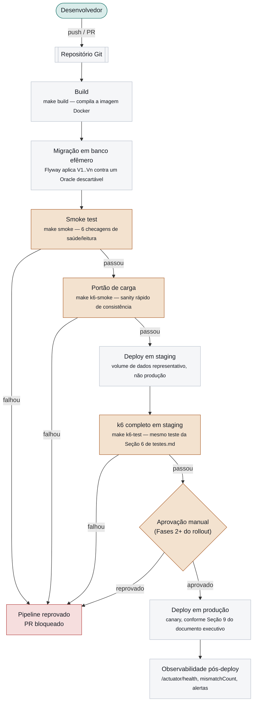
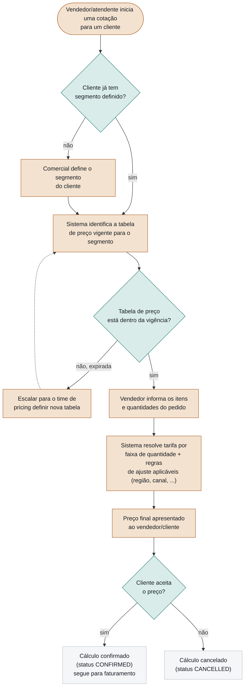
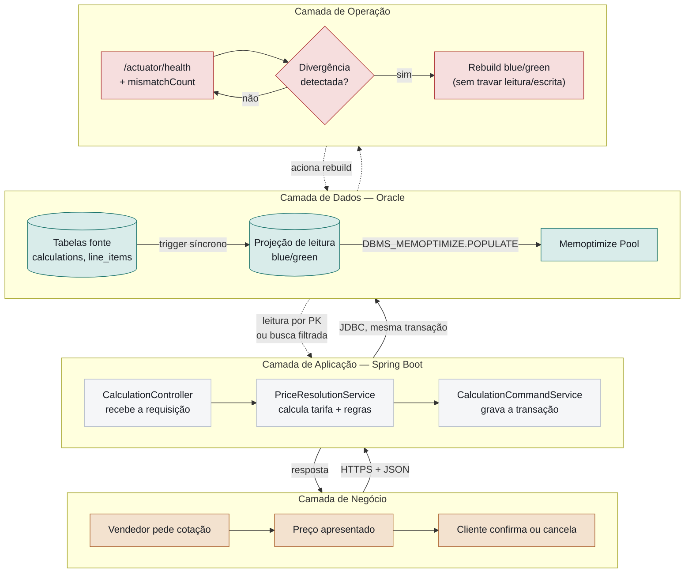
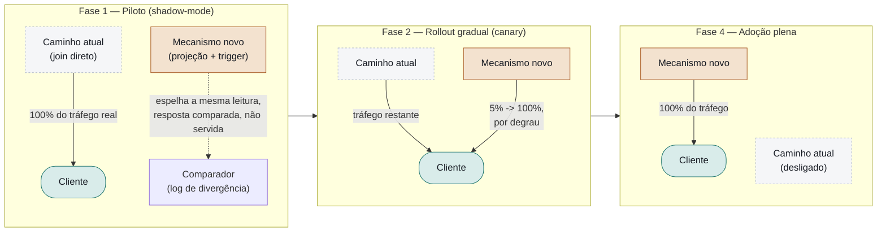

# Ciclo de Vida, Fluxos e Roadmap de Arquitetura

*Ver também: [`docs/README.md`](README.md) (índice geral), [`documento-executivo-poc.md`](documento-executivo-poc.md), [`architecture.md`](architecture.md), [`implementacao.md`](implementacao.md), [`testes.md`](testes.md).*

**Menu:** [0. Diagnóstico](#0-diagnóstico--o-que-estava-faltando) · [1. Hipótese e Prova](#1-hipótese-e-prova) · [2. Versionamento](#2-versionamento) · [3. Fluxo de Integração](#3-fluxo-de-integração-cicd) · [4. Fluxo de Negócio](#4-fluxo-de-negócio) · [5. Fluxo Geral](#5-fluxo-geral-fim-a-fim) · [6. Roadmap de Arquitetura por Fase](#6-roadmap-de-arquitetura-por-fase)

## 0. Diagnóstico — o que estava faltando

Os quatro documentos existentes (`documento-executivo-poc.md`, `architecture.md`, `implementacao.md`, `testes.md`) cobrem bem três etapas do ciclo de vida de software: **decisão de design** (architecture.md), **construção** (implementacao.md) e **validação técnica** (testes.md). Faltavam etapas que amarram essas três a um processo de entrega de software completo — o que este documento resolve:

| Etapa faltando | O que ela responde | Onde está agora |
|---|---|---|
| **Hipótese e prova** | Qual afirmação testável esta PoC fez, explicitamente, antes de rodar qualquer teste — e como cada teste se liga de volta a ela. | Seção 1 abaixo. |
| **Versionamento** | Como o software, o schema de banco e a API evoluem sem quebrar quem já depende deles. | Seção 2 abaixo. |
| **Fluxo de integração** | Como uma mudança de código chega da máquina do desenvolvedor até rodando em produção, com quais portões de qualidade no meio. | Seção 3 abaixo — **gap real**: não existe hoje pipeline de CI/CD nem repositório Git formal; a seção descreve o fluxo recomendado antes de qualquer piloto real. |
| **Fluxo de negócio** | O processo do ponto de vista de quem usa o resultado (não do código) — o que acontece, em termos de negócio, entre "cliente pede um preço" e "preço é cobrado". | Seção 4 abaixo. |
| **Fluxo geral** | Uma visão única que amarra negócio, aplicação e operação — para quem precisa entender o todo sem ler os quatro documentos técnicos. | Seção 5 abaixo. |
| **Cronograma de arquitetura** | Que arquitetura existe em cada fase do rollout (não só quanto tempo cada fase leva, que já está na Seção 9 do documento executivo). | Seção 6 abaixo. |

## 1. Hipótese e Prova

Toda PoC honesta parte de uma hipótese falseável, declarada **antes** de qualquer teste — não uma conclusão reconstruída depois para caber no resultado. Esta é a hipótese desta PoC, formulada nesses termos:

> **H1**: É possível eliminar a necessidade de um cache externo (Redis ou similar) na aplicação de Price mantendo a leitura por identificador de cálculo sempre correta — sem nenhuma janela de inconsistência, mesmo sob escrita concorrente e reconstrução de projeção em andamento — usando exclusivamente mecanismos nativos do Oracle (trigger síncrono + projeção blue/green).
>
> **H2** (secundária, dependente de H1): O Memoptimized Rowstore Fast Lookup acelera essa mesma leitura além do que a tabela de projeção simplificada já entrega sozinha.

Cada hipótese tinha um **critério de falseabilidade** definido antes do teste — a condição que, se observada, provaria a hipótese falsa:

| Hipótese | Falsearia se... | Critério de prova |
|---|---|---|
| H1 | Qualquer leitura pós-escrita, sob qualquer volume ou concorrência testada, retornasse um valor diferente do que a escrita acabou de produzir. | k6: `read_after_write_consistent` teria que ser `100%` sobre milhares de iterações, não uma amostra — ver [`testes.md` Seção 6](testes.md#6-carga-sustentada--k6). |
| H1 | Uma escrita disparada durante uma reconstrução de projeção em andamento se perdesse ou ficasse invisível depois do rebuild. | Escritas concorrentes reais durante um rebuild de 2,7M linhas, com contagem exata no banco depois — ver [`testes.md` Seção 5](testes.md#5-concorrência-real-durante-um-rebuild--o-teste-mais-importante). |
| H2 | O plano de execução real (`DBMS_XPLAN`) de uma leitura por PK não mostrasse a operação `READ OPTIM`. | Foi exatamente o que aconteceu — ver [`testes.md` Seção 2](testes.md#2-fast-lookup--plano-de-execução-real-e-diagnóstico-completo). |

**Resultado**: H1 resistiu a todas as tentativas de falseá-la nesta PoC — nenhuma leitura desatualizada, nenhuma escrita perdida, sob volume e concorrência reais. H2 foi falseada *nesta instância específica* (Oracle Database Free) por uma causa raiz diagnosticada (população do pool nunca aceita pelo processo de background), não confirmada nem refutada de forma definitiva para uma edição com o entitlement correto — permanece uma hipótese em aberto, não uma conclusão. Esta distinção (H1 comprovada, H2 indeterminada) é o motivo pelo qual a Seção 6 do documento executivo trata as duas separadamente, em vez de reportar um veredito único para "o mecanismo".

## 2. Versionamento

Três eixos de versão independentes existem ou precisam existir neste sistema — confundi-los é uma fonte comum de incidente em produção, então cada um está documentado separadamente.

### 2.1 Versão do schema da projeção (`projection_control.schema_version`)

Já implementado. `ProjectionService.SCHEMA_VERSION` (constante Java, hoje `1`) é comparado contra `projection_control.schema_version` a cada bootstrap: se divergem, a projeção é reconstruída automaticamente, mesmo que já esteja `READY`. Esse é o mecanismo que torna o bootstrap "idempotente" no nome do padrão — subir a aplicação de novo com a mesma versão de schema é barato (não reconstrói); subir com uma versão nova força a reconstrução sem intervenção manual. **Regra de evolução**: qualquer migration que mude o formato das colunas da projeção (`calculation_read_projection_a`/`_b`) precisa incrementar `SCHEMA_VERSION` no mesmo commit — do contrário, instâncias antigas e novas da aplicação concordam erroneamente que a projeção existente já serve.

### 2.2 Versão das migrations (Flyway `V1`, `V2`, `V3`)

Já implementado, convenção Flyway padrão: arquivos `V{N}__descrição.sql`, aplicados uma vez, em ordem, e nunca editados depois de aplicados em qualquer ambiente compartilhado — uma migration já aplicada e depois alterada quebra o checksum que o Flyway guarda em `flyway_schema_history`, travando o próximo deploy. Qualquer mudança de schema depois de V3 é uma V4 nova, nunca uma edição de V1-V3.

### 2.3 Versão da aplicação e da API — parcialmente resolvido

O `pom.xml` declara `0.0.1-SNAPSHOT` — versionamento de artefato Maven padrão, mas ainda no estágio "PoC", sem uma política de release. Antes de qualquer piloto real (Fase 1 do cronograma), duas decisões precisam ser tomadas e documentadas:

- **Versionamento semântico do artefato**: adotar `MAJOR.MINOR.PATCH` a partir da primeira versão que sai da PoC (ex.: `1.0.0` no início da Fase 1), incrementando `MAJOR` só em mudança de schema/contrato que quebra compatibilidade com o app cliente da API.
- **Versionamento da API HTTP — ainda um gap real**: os endpoints não têm prefixo de versão (`/api/calculations`, não `/api/v1/calculations`). Isso é aceitável numa PoC de mecanismo interno, mas não deveria sobreviver ao piloto — qualquer consumidor real da API precisa de um contrato estável enquanto o mecanismo evolui por trás. Recomendação: introduzir o prefixo `/api/v1/` já na Fase 1 do rollout (Seção 9 do documento executivo), antes que exista um segundo consumidor para migrar depois.

**Resolvido nesta sessão**: a API agora se auto-documenta via `springdoc-openapi-starter-webmvc-ui` (Swagger UI em `/swagger-ui/index.html`, OpenAPI cru em `/v3/api-docs`) — cada controller tem `@Tag`, cada endpoint tem `@Operation` explicando o que faz e por que (ex.: por que `mode=projection` é o único caminho elegível a Fast Lookup). Isso resolve a falta de *documentação interativa* do contrato atual; não substitui a necessidade de `/api/v1/` quando o contrato precisar evoluir sem quebrar quem já consome — os dois gaps são independentes.

## 3. Fluxo de Integração (CI/CD)

**Estado atual**: não existe repositório Git formal nem pipeline de CI/CD para este projeto — ele roda hoje a partir de uma pasta local, com `make` orquestrando build e verificação manualmente. Isso é apropriado para uma PoC de mecanismo, mas é uma lacuna real e nomeada, não uma omissão deste documento: qualquer piloto (Fase 1 do cronograma) precisa deste fluxo antes de aceitar mudanças de mais de uma pessoa.

O diagrama abaixo é o fluxo **recomendado**, construído em cima das ferramentas que já existem no projeto (Docker, Flyway, `make test`/`smoke`/`k6-smoke`) — nenhuma ferramenta nova precisa ser adotada só para ligar isso, elas só precisam ser encadeadas por um pipeline:

*Fluxo de integração recomendado: cada portão (smoke, k6gate, k6full, aprovação manual) reprova o pipeline inteiro se falhar — nenhum deploy pula uma checagem de consistência, o mesmo princípio de rigor usado na validação da PoC.*

**Ambientes**: o desenho pressupõe três ambientes discretos (efêmero de CI, staging, produção), cada um com sua própria instância Oracle — nunca compartilhando dados entre eles. O ambiente efêmero de CI pode ser descartado a cada execução (por isso a migração roda do zero a cada vez); staging deveria manter um volume de dados grande o suficiente para o k6 completo fazer sentido (a Seção 6 de `testes.md` só é um teste significativo contra uma base já carregada, não uma vazia).

## 4. Fluxo de Negócio

O restante da documentação descreve o mecanismo do ponto de vista técnico — requisição HTTP, trigger, projeção. Esta seção descreve o mesmo cenário do ponto de vista de quem usa o resultado: um vendedor ou atendente que precisa de um preço para fechar ou informar um pedido, sem nenhum termo técnico.

*Fluxo de negócio: cada caixa laranja corresponde a uma operação técnica já implementada (segmento → `customer_segments`, tabela vigente → `price_tables.valid_from/valid_to`, resolução → `PriceResolutionService`, confirmação/cancelamento → `PATCH .../status`) — este diagrama é a leitura de negócio do mesmo processo que `implementacao.md` descreve em código.*

Dois pontos de decisão de negócio (tabela de preço expirada, cliente recusa o preço) hoje não têm um fluxo de exceção formalizado no sistema além do `status=CANCELLED` — ficam registrados aqui como um gap de processo de negócio a resolver junto ao time de Price antes do piloto, não como algo que a PoC precisasse implementar.

## 5. Fluxo Geral (fim a fim)

Uma única visão amarrando as três camadas — negócio, aplicação, operação — para quem precisa do quadro completo sem abrir os quatro documentos técnicos:

*Fluxo geral: a promessa central da PoC (Seção 1 do documento executivo) é a seta pontilhada de `DB` para `APP` nunca devolver um dado desatualizado — todas as outras camadas existem para que essa seta específica seja sempre confiável.*

## 6. Roadmap de Arquitetura por Fase

A Seção 9 do documento executivo já traz o cronograma (quanto tempo cada fase leva). Esta seção completa o que faltava: **qual arquitetura existe de fato em cada fase** — a arquitetura muda de forma incremental, nunca de uma vez.

*Roadmap de arquitetura: o mecanismo novo (laranja) nunca serve tráfego real sozinho antes da Fase 2, e o caminho atual (cinza tracejado) só é desligado na Fase 4, depois de já ter parado de servir tráfego de verdade — a arquitetura de cada fase é deliberadamente mais conservadora que a anterior teria "coragem" de ser.*

Esta progressão de arquitetura é o que torna os critérios de decisão entre fases (já listados na Seção 9 do documento executivo) verificáveis: "zero divergência no shadow-mode" só é uma pergunta que faz sentido porque a Fase 1 literalmente compara as duas arquiteturas rodando ao mesmo tempo, e "canary estável por dias" só é possível porque a Fase 2 mantém as duas arquiteturas coexistindo, uma servindo cada vez menos tráfego.
