# Implementação — Código e Detalhes Técnicos

Este documento complementa `docs/architecture.md` (decisões e trade-offs) e
`docs/documento-executivo-poc.md` (leitura executiva): aqui está o código
real, camada por camada, com o trecho relevante de cada arquivo e a razão de
cada decisão de implementação. Todo caminho de arquivo é relativo à raiz do
projeto.

*Ver também: [`docs/README.md`](README.md) (índice geral), [`documento-executivo-poc.md`](documento-executivo-poc.md), [`architecture.md`](architecture.md), [`testes.md`](testes.md), [`fluxos-e-ciclo-de-vida.md`](fluxos-e-ciclo-de-vida.md).*

**Menu:** [1. Banco de dados](#1-banco-de-dados--migrations-flyway) · [2. Camada de aplicação](#2-camada-de-aplicação--java-spring-boot-41-java-21) ([diagrama de classe](#21-diagrama-de-classe)) · [3. Carga em massa](#3-carga-em-massa-oraclebenchmark01_load_datasql) · [4. Ferramentas de verificação](#4-ferramentas-de-verificação)

## 1. Banco de dados — migrations Flyway

Três migrations (`src/main/resources/db/migration/`), aplicadas na ordem
pelo Flyway no boot da aplicação (`spring-boot-starter-flyway` — ver nota no
final desta seção).

### V1 — schema fonte e projeção (`V1__create_source_and_projection.sql`)

Cria as 8 tabelas do domínio (catálogo + transacional), a view de junção, os
dois slots físicos da projeção e o `SYNONYM` que os liga desde o início —
sem etapa de "renomear tabela existente" que uma versão anterior deste PoC
precisou.

```sql
CREATE TABLE calculation_read_projection_a (
    calculation_id         NUMBER(19)    NOT NULL,
    customer_id            NUMBER(19)    NOT NULL,
    customer_name          VARCHAR2(200) NOT NULL,
    customer_email         VARCHAR2(320) NOT NULL,
    segment_code           VARCHAR2(30)  NOT NULL,
    segment_name           VARCHAR2(100) NOT NULL,
    price_table_id         NUMBER(19)    NOT NULL,
    price_table_name       VARCHAR2(150) NOT NULL,
    status                 VARCHAR2(20)  NOT NULL,
    line_item_count        NUMBER(10)    NOT NULL,
    total_amount           NUMBER(19,4)  NOT NULL,
    rules_applied_count    NUMBER(10)    DEFAULT 0 NOT NULL,
    total_adjustment       NUMBER(19,4)  DEFAULT 0 NOT NULL,
    requested_at           TIMESTAMP(6) WITH TIME ZONE NOT NULL,
    calculated_at          TIMESTAMP(6) WITH TIME ZONE,
    projection_updated_at  TIMESTAMP(6) WITH TIME ZONE NOT NULL,
    CONSTRAINT pk_calculation_read_projection_a PRIMARY KEY (calculation_id)
)
SEGMENT CREATION IMMEDIATE
MEMOPTIMIZE FOR READ;
```

`_b` é uma cópia idêntica. `MEMOPTIMIZE FOR READ` vai direto no `CREATE
TABLE`, nunca via `ALTER TABLE` depois — `ORA-62149` recusa habilitar o
atributo assim que qualquer índice sobre uma coluna `TIMESTAMP WITH TIME
ZONE` (como `requested_at DESC`, logo abaixo) já tiver criado sua coluna
virtual oculta. Como os dois slots nascem assim, o atributo nunca precisa
ser ligado/desligado por nenhum código de rebuild.

```sql
CREATE SYNONYM calculation_read_projection FOR calculation_read_projection_a;

CREATE TABLE projection_control (
    projection_name      VARCHAR2(100) NOT NULL,
    status                VARCHAR2(30)  NOT NULL,
    schema_version        NUMBER(10)    NOT NULL,
    active_slot           CHAR(1)       DEFAULT 'A' NOT NULL,
    ...
    CONSTRAINT ck_projection_status CHECK (status IN ('NEEDS_REBUILD', 'BUILDING', 'READY')),
    CONSTRAINT ck_projection_active_slot CHECK (active_slot IN ('A', 'B'))
);
```

`projection_control` é a linha única (mutex) que toda instância da
aplicação disputa antes de reconstruir a projeção — ver Seção 3.

A `calculation_transactional_view` é a fonte de verdade que a projeção
espelha — o join de 4 tabelas mais a agregação de itens que a projeção
existe para evitar no caminho de leitura quente:

```sql
CREATE OR REPLACE VIEW calculation_transactional_view AS
SELECT c.id AS calculation_id, c.customer_id, cu.name AS customer_name,
       cu.email AS customer_email, seg.code AS segment_code, seg.name AS segment_name,
       c.price_table_id, pt.name AS price_table_name, c.status,
       NVL(li.line_item_count, 0) AS line_item_count, c.total_amount,
       NVL(li.rules_applied_count, 0) AS rules_applied_count,
       NVL(li.total_adjustment, 0) AS total_adjustment,
       c.requested_at, c.calculated_at
  FROM calculations c
  JOIN customers cu ON cu.id = c.customer_id
  JOIN customer_segments seg ON seg.id = cu.segment_id
  JOIN price_tables pt ON pt.id = c.price_table_id
  LEFT JOIN (
      SELECT calculation_id, COUNT(*) AS line_item_count,
             SUM(rules_applied_count) AS rules_applied_count,
             SUM(adjustment_amount) AS total_adjustment
        FROM calculation_line_items GROUP BY calculation_id
  ) li ON li.calculation_id = c.id;
```

### V2 — manutenção da projeção (`V2__create_projection_maintenance.sql`)

**`calculation_maintenance_pkg`** faz o `MERGE` incremental, sempre a partir
da view acima, por um único `calculation_id`:

```sql
PROCEDURE refresh_calculation(p_calculation_id IN NUMBER) IS
BEGIN
    MERGE INTO calculation_read_projection target
    USING (SELECT * FROM calculation_transactional_view
            WHERE calculation_id = p_calculation_id) source
    ON (target.calculation_id = source.calculation_id)
    WHEN MATCHED THEN UPDATE SET ... , target.projection_updated_at = SYSTIMESTAMP
    WHEN NOT MATCHED THEN INSERT (...) VALUES (...);
END refresh_calculation;
```

Três triggers acionam esse `MERGE`. O trigger em `customers` é uma linha
simples (dado só denormalizado para exibição):

```sql
CREATE OR REPLACE TRIGGER trg_customers_calc_projection
AFTER UPDATE OF name, email ON customers
FOR EACH ROW
BEGIN
    UPDATE calculation_read_projection
       SET customer_name = :NEW.name, customer_email = :NEW.email,
           projection_updated_at = SYSTIMESTAMP
     WHERE customer_id = :NEW.id;
END;
```

Os triggers em `calculations` e `calculation_line_items` **precisam** ser
**compound triggers** — não uma decisão estética. Um trigger simples `AFTER
EACH ROW` que chamasse `refresh_calculation` diretamente dispararia
`ORA-04091` (mutating table): `refresh_calculation` lê
`calculation_transactional_view`, que faz join de volta com a própria
tabela `calculations` que está sendo escrita. O padrão compound resolve
isso coletando os IDs afetados durante `AFTER EACH ROW` e só resolvendo,
uma vez por ID, em `AFTER STATEMENT` — depois que a instrução inteira já
terminou de escrever:

```sql
CREATE OR REPLACE TRIGGER trg_calculations_projection
FOR INSERT OR UPDATE OR DELETE ON calculations
COMPOUND TRIGGER
    TYPE t_action IS TABLE OF VARCHAR2(10) INDEX BY VARCHAR2(40);
    g_actions t_action;

    AFTER EACH ROW IS
    BEGIN
        IF DELETING THEN g_actions(TO_CHAR(:OLD.id)) := 'REMOVE';
        ELSE g_actions(TO_CHAR(:NEW.id)) := 'REFRESH';
        END IF;
    END AFTER EACH ROW;

    AFTER STATEMENT IS
        v_key VARCHAR2(40);
    BEGIN
        v_key := g_actions.FIRST;
        WHILE v_key IS NOT NULL LOOP
            IF g_actions(v_key) = 'REMOVE' THEN
                calculation_maintenance_pkg.remove_calculation(TO_NUMBER(v_key));
            ELSE
                calculation_maintenance_pkg.refresh_calculation(TO_NUMBER(v_key));
            END IF;
            v_key := g_actions.NEXT(v_key);
        END LOOP;
    END AFTER STATEMENT;
END trg_calculations_projection;
```

`trg_calc_line_items_projection` segue o mesmo padrão, mas coleciona
`calculation_id` (não o próprio ID da linha) e trata `INSERT`/`UPDATE`/
`DELETE` em conjunto — um `UPDATE` que move uma linha de um cálculo para
outro precisa atualizar os dois lados.

**`projection_admin_pkg`** é o pacote de administração blue/green — a peça
central de todo o mecanismo de rebuild. Os oito procedimentos/funções e a
razão de cada um:

| Rotina | Papel |
|---|---|
| `active_table` / `inactive_table` | Resolvem o slot atual a partir de `projection_control.active_slot` — nunca hardcoded. |
| `reconcile_active_slot` | Corrige `active_slot` se um `cutover` anterior travou entre a troca do synonym (DDL, commit implícito) e a atualização da linha de controle. |
| `build_inactive` | `TRUNCATE` + `INSERT ... SELECT` da view inteira no slot **inativo** — nenhuma tabela fonte é travada; o ativo continua servindo o tempo todo. |
| `converge_inactive` | `MERGE` tabela-a-tabela (do ativo, não da view) para puxar o que os triggers aplicaram enquanto o build rodava; roda em loop curto. |
| `cutover` | Única etapa que trava algo — só a tabela **ativa**, com `LOCK TABLE ... IN SHARE MODE` — faz a convergência final, valida com `MINUS` nos dois sentidos, e só então troca o synonym. |
| `mismatch_count` | `MINUS` bidirecional entre view e projeção — usado por `/api/admin/projection/validate` sem qualquer rebuild. |
| `request_population` | Chama `DBMS_MEMOPTIMIZE.POPULATE` sob demanda. |

O corpo de `cutover` — o trecho mais sensível do pacote — está reproduzido
por completo, porque a ordem das operações é o que garante a promessa de
"nenhuma escrita perdida na borda":

```sql
PROCEDURE cutover IS
    v_active    VARCHAR2(40) := active_table;
    v_inactive  VARCHAR2(40) := inactive_table;
    v_new_slot  CHAR(1) := SUBSTR(inactive_table, -1);
    v_converged NUMBER;
    v_mismatch  NUMBER;
BEGIN
    DBMS_MEMOPTIMIZE.POPULATE(USER, v_inactive);          -- antes de travar qualquer coisa

    EXECUTE IMMEDIATE 'LOCK TABLE ' || v_active || ' IN SHARE MODE';

    v_converged := converge_inactive;                      -- convergência final, sob o lock

    -- validação MINUS nos dois sentidos (inativo -> ativo, depois ativo -> inativo)
    ...
    IF v_mismatch > 0 THEN
        RAISE_APPLICATION_ERROR(-20001,
            'Cutover aborted: ' || v_mismatch || ' row(s) differ between ' ||
            v_inactive || ' and ' || v_active);
    END IF;

    EXECUTE IMMEDIATE 'CREATE OR REPLACE SYNONYM calculation_read_projection FOR ' || v_inactive;
    -- DDL acima faz commit implícito -- é isso que libera o lock SHARE, e é
    -- exatamente a instrução que reaponta o synonym. Qualquer escritor que
    -- estava bloqueado nela resume aqui, já vendo o synonym novo.

    UPDATE projection_control SET active_slot = v_new_slot WHERE projection_name = 'CALCULATION_READ_PROJECTION';
    COMMIT;
END cutover;
```

### V3 — seed de demonstração (`V3__seed_demonstration_data.sql`)

Popula o catálogo (2 segmentos, 2 tabelas de preço, 6 itens, 9 tarifas, 2
regras) e 2 clientes/cálculos de demonstração com matemática conferida à
mão — o cálculo #2 (`total_amount=330.24`, `adjustment=5.76`) é o mesmo
número reproduzido ao vivo via API na Seção 5 do documento executivo.

**Nota Spring Boot 4 / Flyway**: `flyway-core` sozinho (padrão do Spring
Boot 3.x) não é suficiente no Boot 4 — a autoconfiguração do Flyway foi
movida para o starter dedicado `spring-boot-starter-flyway`. Sem ele, as
migrations simplesmente nunca rodam, sem nenhum erro visível no boot.

## 2. Camada de aplicação — Java (Spring Boot 4.1, Java 21)

Estrutura em `src/main/java/com/example/projection/`: `api/` (controllers
REST), `application/` (serviços e repositórios), `config/`, `support/`.

### 2.1 Diagrama de classe

O diagrama de componentes do blueprint C4 (`documento-executivo-poc.md`)
mostra as mesmas classes como caixas conectadas por dependência, sem
assinatura de método — útil para enxergar a arquitetura de longe, não para
saber o que cada classe expõe de verdade. Este é o nível de código: campo
por campo, método por método, exatamente como estão implementados hoje.

```mermaid
classDiagram
    class CustomerController {
        <<RestController>>
        -CustomerService customerService
        +create(CustomerRequest) CustomerResponse
        +update(long, CustomerRequest) CustomerResponse
    }
    class CalculationController {
        <<RestController>>
        -CalculationCommandService calculationService
        +create(CreateCalculationRequest) CreatedCalculation
        +updateStatus(long, UpdateCalculationStatusRequest) Map
        +delete(long) void
    }
    class CalculationReadController {
        <<RestController>>
        -CalculationReadRepository repository
        +findById(long, String mode) CalculationReadResult
        +search(String, Long, String, String, int, String) CalculationSearchResult
    }
    class ProjectionAdminController {
        <<RestController>>
        -ProjectionService projectionService
        -FastLookupPlanService planService
        +status() ProjectionStatus
        +memoptimized() MemoptimizedStatus
        +plan(long) FastLookupPlan
        +validate() ProjectionStatus
        +rebuild() ProjectionStatus
    }

    class CustomerService {
        <<Service>>
        -JdbcClient jdbc
        +create(long, String, String, String) CustomerResponse
        +update(long, long, String, String, String) CustomerResponse
    }
    class CalculationCommandService {
        <<Service>>
        -JdbcClient jdbc
        -PriceResolutionService priceResolution
        +create(long, long, List~LineItemRequest~) CreatedCalculation
        +updateStatus(long, String) void
        +delete(long) void
        -insertLineItem(long, LineItemRequest) BigDecimal
        -assertCustomerExists(long) void
        -assertPriceTableExists(long) void
    }
    class PriceResolutionService {
        <<Service>>
        -JdbcClient jdbc
        +resolve(long, int, String) Resolution
        -apply(BigDecimal, String, BigDecimal)$ BigDecimal
    }
    class CalculationReadRepository {
        <<Repository>>
        -JdbcClient jdbc
        +findProjectionById(long) CalculationReadResult
        +findTransactionalById(long) CalculationReadResult
        +search(String, Long, String, String, int, String) CalculationSearchResult
        -count(String, Filters) long
        -fetchPage(String, Filters, int, String) List
        -encodeCursor(OffsetDateTime, long)$ String
        -decodeCursor(String)$ Cursor
    }
    class ProjectionService {
        <<Service>>
        -JdbcClient jdbc
        -ProjectionProperties properties
        -TransactionTemplate transactions
        +ensureReady() ProjectionStatus
        +rebuild(boolean) ProjectionStatus
        +validate() ProjectionStatus
        +getStatus() ProjectionStatus
        +getMemoptimizedStatus() MemoptimizedStatus
        -attemptRebuild(boolean) ProjectionStatus
        -rebuildInTransaction(boolean) ProjectionStatus
        -lockControlRow() ProjectionStatus
        -waitUntilReady() ProjectionStatus
    }
    class FastLookupPlanService {
        <<Service>>
        -JdbcClient jdbc
        +inspect(long) FastLookupPlan
    }
    class ProjectionBootstrapRunner {
        <<ApplicationRunner>>
        -ProjectionService projectionService
        -ProjectionProperties properties
        +run(ApplicationArguments) void
    }
    class ProjectionHealthIndicator {
        <<HealthIndicator>>
        -ProjectionService projectionService
        +health() Health
    }
    class ApiExceptionHandler {
        <<RestControllerAdvice>>
        +notFound(NotFoundException) ResponseEntity
        +badRequest(IllegalArgumentException) ResponseEntity
        +validation(MethodArgumentNotValidException) ResponseEntity
    }
    class NotFoundException {
        <<RuntimeException>>
    }

    CustomerController --> CustomerService
    CalculationController --> CalculationCommandService
    CalculationCommandService --> PriceResolutionService
    CalculationReadController --> CalculationReadRepository
    ProjectionAdminController --> ProjectionService
    ProjectionAdminController --> FastLookupPlanService
    ProjectionBootstrapRunner --> ProjectionService
    ProjectionHealthIndicator --> ProjectionService
    ApiExceptionHandler ..> NotFoundException : trata
```



Duas coisas que o diagrama deixa visíveis e que valem nomear: primeiro,
todas as dependências apontam numa única direção — controller → serviço,
nunca o contrário, e nenhum serviço depende de outro controller; segundo,
`ProjectionService` é a única classe com métodos privados relevantes o
bastante para aparecer aqui (`attemptRebuild`, `rebuildInTransaction`,
`lockControlRow`, `waitUntilReady`) — reflexo direto de ser a peça mais
complexa do sistema (Seção 0.1.1 de `docs/testes.md` mostra os mesmos
métodos como a maior concentração de branches não testados).

**Visão de implantação (deployment)**: já coberta no C4 Nível 2
(Container) do blueprint — Fig. 2 de `documento-executivo-poc.md` mostra
os dois containers Docker (`app` e `oracle`), a conexão JDBC entre eles, e
o memoptimize pool como uma região dentro do container Oracle. Não
duplicado aqui; ver aquele diagrama para topologia, este aqui para código.

### `PriceResolutionService` — o cálculo de preço em si

Único ponto do sistema que resolve tarifa e regras. `resolve` busca o preço
base do item, encontra a tarifa cuja faixa de quantidade e janela de
vigência casam, aplica o ajuste da tarifa (`PERCENT` multiplica,
`FIXED` soma), depois aplica cada `tariff_rule` casada pela condição
informada, em ordem de `priority`:

```java
public Resolution resolve(long priceTableItemId, int quantity, String ruleConditionValue) {
    BigDecimal basePrice = jdbc.sql("SELECT base_price FROM price_table_items WHERE id = :itemId")
            .param("itemId", priceTableItemId)
            .query(BigDecimal.class).optional()
            .orElseThrow(() -> new NotFoundException("Price table item " + priceTableItemId + " was not found"));

    TariffRow tariff = jdbc.sql("""
            SELECT id, rate_type, rate_value FROM tariffs
             WHERE price_table_item_id = :itemId
               AND :quantity >= min_quantity
               AND (max_quantity IS NULL OR :quantity <= max_quantity)
               AND valid_from <= SYSDATE AND (valid_to IS NULL OR valid_to >= SYSDATE)
             ORDER BY min_quantity DESC FETCH FIRST 1 ROW ONLY
            """)
            .param("itemId", priceTableItemId).param("quantity", quantity)
            .query(PriceResolutionService::mapTariff).optional()
            .orElseThrow(() -> new NotFoundException("No tariff applies to item " + priceTableItemId + " at quantity " + quantity));

    BigDecimal unitPriceAfterTariff = apply(basePrice, tariff.rateType(), tariff.rateValue());

    List<RuleRow> rules = ruleConditionValue == null ? List.of() : jdbc.sql("""
            SELECT adjustment_type, adjustment_value FROM tariff_rules
             WHERE tariff_id = :tariffId AND condition_value = :conditionValue ORDER BY priority
            """)
            .param("tariffId", tariff.id()).param("conditionValue", ruleConditionValue)
            .query(PriceResolutionService::mapRule).list();

    BigDecimal unitPrice = unitPriceAfterTariff;
    for (RuleRow rule : rules) unitPrice = apply(unitPrice, rule.adjustmentType(), rule.adjustmentValue());

    BigDecimal adjustmentAmount = unitPriceAfterTariff.subtract(unitPrice).multiply(BigDecimal.valueOf(quantity));
    BigDecimal lineTotal = unitPrice.multiply(BigDecimal.valueOf(quantity));
    return new Resolution(tariff.id(), unitPrice, rules.size(), adjustmentAmount, lineTotal);
}
```

Nota deliberada: esta é uma resolução determinística e simples (uma faixa
de tarifa por quantidade + regras por condição exata) — não um motor de
regras genérico. Ver Seção 7 do documento executivo (Riscos e Trade-offs).

### `CalculationCommandService` — escrita transacional

`create` valida cliente e tabela de preço, insere o cabeçalho do cálculo
com `total_amount=0`, resolve e insere cada item de linha via
`PriceResolutionService`, e só então fecha o total — tudo dentro de uma
única transação Spring (`@Transactional`), o que significa que qualquer
falha em qualquer trigger de projeção derruba a escrita inteira:

```java
@Transactional
public CreatedCalculation create(long customerId, long priceTableId, List<LineItemRequest> items) {
    assertCustomerExists(customerId);
    assertPriceTableExists(priceTableId);

    long calculationId = jdbc.sql("SELECT calculation_seq.NEXTVAL FROM dual").query(Long.class).single();
    jdbc.sql("""
            INSERT INTO calculations (id, customer_id, price_table_id, status, calculated_at, total_amount)
            VALUES (:id, :customerId, :priceTableId, 'CALCULATED', SYSTIMESTAMP, 0)
            """)
            .param("id", calculationId).param("customerId", customerId).param("priceTableId", priceTableId).update();

    BigDecimal total = BigDecimal.ZERO;
    for (LineItemRequest item : items) total = total.add(insertLineItem(calculationId, item));

    jdbc.sql("UPDATE calculations SET total_amount = :total WHERE id = :id")
            .param("total", total).param("id", calculationId).update();

    return new CreatedCalculation(calculationId, customerId, "CALCULATED", items.size(), total);
}
```

Cada `INSERT` em `calculations` e em `calculation_line_items` dentro deste
método dispara, de forma síncrona e ainda dentro desta mesma transação, os
compound triggers da Seção 1 — é esse encadeamento que garante que a
projeção nunca fica "atrás" da escrita.

### `CalculationReadRepository` — leitura por PK e busca filtrada

Dois caminhos deliberadamente diferentes. `findProjectionById` é o caminho
quente, elegível ao Fast Lookup — um único `SELECT * ... WHERE
calculation_id = :id` contra o synonym. `search` é o caminho de produção
para busca filtrada: duas queries, nunca uma:

```java
public CalculationSearchResult search(
        String mode, Long customerId, String status, String email, int limit, String cursor) {
    String source = switch (mode.toLowerCase()) {
        case "projection" -> "calculation_read_projection";
        case "transactional" -> "calculation_transactional_view";
        default -> throw new IllegalArgumentException("mode must be 'projection' or 'transactional'");
    };
    Filters filters = new Filters(customerId, status, email);

    long total = count(source, filters);                       // query 1: COUNT(*)
    List<CalculationReadResult> fetched = fetchPage(source, filters, limit, cursor); // query 2: keyset

    String nextCursor = null;
    List<CalculationReadResult> page = fetched;
    if (fetched.size() > limit) {                               // fetchPage pediu limit+1 de propósito
        CalculationReadResult last = fetched.get(limit - 1);
        nextCursor = encodeCursor(last.requestedAt(), last.calculationId());
        page = fetched.subList(0, limit);
    }
    return new CalculationSearchResult(total, page, nextCursor);
}
```

`fetchPage` monta a query de keyset — `WHERE (requested_at,
calculation_id) < (:cursorRequestedAt, :cursorCalculationId) ORDER BY
requested_at DESC, calculation_id DESC FETCH FIRST :fetchLimit ROWS ONLY`
— e pede deliberadamente `limit + 1` linhas: se a linha extra vier, existe
próxima página, sem precisar de uma terceira query só para responder "tem
mais?". `encodeCursor`/`decodeCursor` empacotam
`requestedAt.toString() + "|" + calculationId` em base64 — um cursor opaco
para o cliente da API.

### `ProjectionService` — o mutex e o rebuild blue/green

`ensureReady`/`rebuild` chamam `rebuildInTransaction`, cujo primeiro passo
é o mutex de linha:

```java
private ProjectionStatus lockControlRow() {
    return jdbc.sql("""
            SELECT projection_name, status, schema_version, active_slot, ...
              FROM projection_control WHERE projection_name = :name
               FOR UPDATE WAIT 0
            """)
            .param("name", PROJECTION_NAME)
            .query(ProjectionService::mapStatus).single();
}
```

`FOR UPDATE WAIT 0` falha rápido (`ORA-00054`) se outra instância já
segura a linha — mas esse lock só protege até a primeira instrução DDL
dentro de `cutover` (que faz commit implícito e libera o lock cedo demais).
Por isso existe um segundo guard, um `UPDATE` condicional que só "ganha" o
rebuild se conseguir realmente mudar o status:

```java
private ProjectionStatus rebuildInTransaction(boolean force) {
    ProjectionStatus current = lockControlRow();
    if (!force && current.ready() && current.schemaVersion() == SCHEMA_VERSION) return current;

    jdbc.sql("BEGIN projection_admin_pkg.reconcile_active_slot; END;").update();

    int claimed = jdbc.sql("""
            UPDATE projection_control SET status = 'BUILDING', build_owner = :owner, ...
             WHERE projection_name = :name AND status <> 'BUILDING'
            """)
            .param("owner", buildOwner()).param("name", PROJECTION_NAME).update();
    if (claimed == 0) {
        // Esta transação ainda segura o lock FOR UPDATE desta mesma linha:
        // esperar aqui bloquearia o UPDATE final da outra instância e
        // causaria deadlock. Em vez disso, lança para forçar rollback
        // (liberando o lock) antes de aguardar READY.
        throw new ProjectionBuildInProgressException();
    }

    jdbc.sql("BEGIN projection_admin_pkg.build_inactive; END;").update();
    for (int pass = 0; pass < CONVERGE_PASSES; pass++) {
        jdbc.sql("DECLARE v_delta NUMBER; BEGIN v_delta := projection_admin_pkg.converge_inactive; END;").update();
    }
    jdbc.sql("BEGIN projection_admin_pkg.cutover; END;").update();

    long sourceCount = count("calculation_transactional_view");
    long projectionCount = count("calculation_read_projection");
    long mismatches = mismatchCount();
    if (mismatches != 0 || sourceCount != projectionCount) {
        throw new IllegalStateException("Projection validation failed: source=%d projection=%d mismatches=%d"
                .formatted(sourceCount, projectionCount, mismatches));
    }
    jdbc.sql("UPDATE projection_control SET status = 'READY', ... WHERE projection_name = :name")
            .param(...).update();

    return getStatus();
}
```

`ProjectionBuildInProgressException` (classe privada estática interna) é o
mecanismo exato que resolve o deadlock descrito no comentário — sem ela, a
primeira versão deste método tentava chamar `waitUntilReady()` direto
enquanto ainda segurava o lock, travando as duas instâncias uma na outra.

### Outros componentes de suporte

- **`FastLookupPlanService.inspect`**: roda a query real por PK, depois lê
  `DBMS_XPLAN.DISPLAY_CURSOR(NULL, NULL, 'BASIC +PREDICATE')` do cursor que
  acabou de executar (não um plano estimado) e procura literalmente a
  string `READ OPTIM` nas linhas do plano — é essa checagem, e não o
  atributo `MEMOPTIMIZE_READ=ENABLED` da tabela, que prova (ou não) que o
  Fast Lookup está de fato em uso.
- **`ProjectionBootstrapRunner`**: `ApplicationRunner` que chama
  `projectionService.ensureReady()` uma vez no startup, se
  `properties.bootstrapOnStartup()` estiver ligado — é o "Idempotent
  Bootstrap" do nome do padrão: rodar de novo com a projeção já pronta é
  barato (`current.ready() && schemaVersion == SCHEMA_VERSION` retorna
  cedo).
- **`ProjectionHealthIndicator`**: expõe `ProjectionService.getStatus()`
  como um `HealthIndicator` do Spring Actuator — é o que aparece em
  `/actuator/health/readiness`.

### API REST (`api/`)

Quatro controllers, todos finos — sem lógica de negócio, só tradução
HTTP↔serviço: `CustomerController`, `CalculationController` (`POST
/api/calculations`, `PATCH /api/calculations/{id}/status`, `DELETE
/api/calculations/{id}`), `CalculationReadController` (`GET
/api/read/calculations/{id}?mode=`, `GET /api/read/calculations?...`) e
`ProjectionAdminController` (`status`/`memoptimized`/`plan/{id}`/
`validate`/`rebuild`). `ApiExceptionHandler` (`@RestControllerAdvice`)
traduz `NotFoundException` em `404` e erros de validação em `400`
centralizadamente.

## 3. Carga em massa (`oracle/benchmark/01_load_data.sql`)

Script SQL*Plus, não um loop Java — necessário porque o volume (milhões de
linhas) tornaria um loop linha-a-linha via JDBC lento demais para ser
prático. Dois pontos de engenharia real, além do já coberto na Seção 1:

**Gerador de linhas sem estourar PGA.** Um único `CONNECT BY LEVEL <= N`
estoura PGA por volta de N ≈ 1-2 milhões (`ORA-30009`). A solução usa dois
geradores pequenos (≤ 2000 níveis cada) cruzados:

```sql
SELECT (a.lvl - 1) * 2000 + b.lvl AS rn
  FROM (SELECT LEVEL AS lvl FROM dual CONNECT BY LEVEL <= CEIL(&ROW_COUNT / 2000)) a
 CROSS JOIN (SELECT LEVEL AS lvl FROM dual CONNECT BY LEVEL <= 2000) b
 WHERE rn <= &ROW_COUNT;
```

Isso cobre `N = a × b` linhas sem que nenhum dos dois geradores construa
uma hierarquia profunda — funciona para qualquer `N`, não só para o volume
testado nesta PoC.

**Triggers desligados durante a carga, religados antes do rebuild:**

```sql
ALTER TRIGGER trg_calculations_projection DISABLE;
ALTER TRIGGER trg_calc_line_items_projection DISABLE;
-- ... INSERT ... SELECT set-based ...
ALTER TRIGGER trg_calculations_projection ENABLE;
ALTER TRIGGER trg_calc_line_items_projection ENABLE;
```

Com os triggers desligados, o slot ativo nunca vê as linhas novas — por
isso o script **não** chama `projection_admin_pkg.cutover` (cujo
`converge_inactive` trataria toda linha carregada como órfã contra o ativo
obsoleto e as apagaria). Em vez disso, o bloco PL/SQL final replica só a
parte de `cutover` que faz sentido aqui: `build_inactive`, validação direta
contra `calculation_transactional_view` via `MINUS` nos dois sentidos, e
troca manual do synonym — sem nenhuma chamada a `converge_inactive`. Ao
final, `DBMS_STATS.GATHER_TABLE_STATS(..., method_opt => 'FOR ALL COLUMNS
SIZE SKEWONLY')` gera o histograma necessário para o otimizador diferenciar
o cliente de benchmark (dono de quase todas as linhas) dos demais — ver a
evidência de 0,456s → 0,062s em `docs/testes.md`.

## 4. Ferramentas de verificação

- **Suíte de testes automatizada** (`src/test/java/`): 45 unit tests
  (JUnit 5 + Mockito, sem banco — resolução de preço, cursor/filtros,
  validação de DTOs, `ApiExceptionHandler`, `ProjectionHealthIndicator`,
  `ProjectionBootstrapRunner`, e 4 slices `@WebMvcTest` para os
  controllers) + 21 integration tests (Testcontainers + Oracle real —
  ciclo de vida de cálculo, rebuild blue/green, busca por keyset,
  `CustomerService.update`, `FastLookupPlanService`, e os dois ramos de
  disputa pelo mesmo rebuild forçados deterministicamente em
  `ProjectionMutexIT`, sem depender de race real). `make test` roda a
  primeira camada; `make test-integration` a segunda. Cobertura medida com
  JaCoCo: **93,6% de linhas, 93,9% de instruções, 81,7% de branches** —
  acima de 90%/80% nas três métricas. Detalhes completos e o resultado
  (66/66) em `docs/testes.md` Seção 0.1/0.1.1.
- **Swagger UI / OpenAPI**: `springdoc-openapi-starter-webmvc-ui` (a linha
  3.x, compatível com Spring Boot 4/Spring Framework 7). UI em
  `/swagger-ui/index.html`, spec em `/v3/api-docs`, metadata em
  `config/OpenApiConfig.java`. Cada controller tem `@Tag`, cada endpoint
  tem `@Operation` — não é a anotação vazia default do framework, cada
  descrição explica uma decisão real (ex.: por que `mode=projection` é o
  único caminho elegível a Fast Lookup, ou que `/api/admin/projection/*`
  não tem autenticação). `make swagger` imprime as URLs.
- **Postman**: `postman/oracle-read-projection-poc.postman_collection.json`
  — todos os endpoints, com scripts de teste que capturam automaticamente
  `customerId`, `calculationId` e `searchCursor` como variáveis de coleção.
- **k6**: `k6/read-after-write-test.js` — detalhado em `docs/testes.md`.
- **Smoke test**: `scripts/smoke-test.sh` — seis `curl` sequenciais contra
  saúde, status da projeção, memoptimize, leitura por PK (dois modos) e
  plano de execução; usado por `make smoke`.
- **Makefile**: ponto de entrada único para todas as operações (`make
  help` lista tudo) — ambiente, qualidade, administração da projeção,
  dados/carga, k6, referência.
